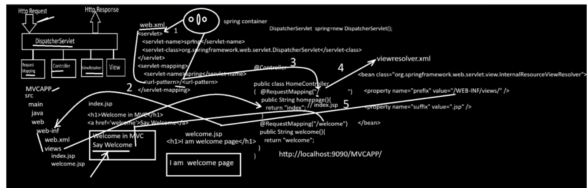

---

# Spring MVC

---

## Q. What is the meaning of MVC?

---

**MVC** stands for **Model, View, and Controller**. It is a **design pattern** used in web application development to separate the application's business logic, presentation logic, and request-handling logic.

### M - Model

* The **Model** is a Java POJO (Plain Old Java Object) class.
* It stores the data sent by the user through the View.
* It contains variables, constructors, getter and setter methods.
* It represents the application's data and business objects.

### V - View

* The **View** is the presentation layer.
* It is responsible for displaying data to the user and collecting user input.
* In Spring MVC, views are commonly created using **JSP**, **Thymeleaf**, **FreeMarker**, etc.

### C - Controller

* The **Controller** is a Spring class annotated with **@Controller**.
* It receives HTTP requests from the user.
* It processes the request, communicates with the service/business layer, stores data in the Model, and returns the appropriate View.

**Flow:**

```
Client Request
      ↓
 Controller
      ↓
Business Logic
      ↓
    Model
      ↓
     View
      ↓
Client Response
```

---

# Q. Why do we use Spring MVC?

---

Spring MVC provides many advantages:

### 1. Separation of Concerns

* Separates presentation logic, business logic, and data access logic.
* Makes the application easier to understand and maintain.

### 2. Easy Request Handling

* Maps URLs to controller methods using annotations such as:

  * `@RequestMapping`
  * `@GetMapping`
  * `@PostMapping`

### 3. Integration with Spring Framework

* Integrates easily with:

  * Spring Boot
  * Spring Data JPA
  * Spring Security
  * Spring JDBC
  * Spring REST

### 4. Flexible View Technologies

Supports multiple view technologies such as:

* JSP
* Thymeleaf
* FreeMarker
* Velocity

### 5. Form Handling and Validation

Supports form submission and validation using:

* `@ModelAttribute`
* `@Valid`
* `BindingResult`

### 6. Loose Coupling

Different layers remain independent, making the application easier to test and maintain.

---

# Spring MVC Architecture

---

```
Browser
   │
HTTP Request
   │
DispatcherServlet (Front Controller)
   │
Handler Mapping
   │
Controller
   │
Service Layer (Optional)
   │
DAO / Repository
   │
Database
   │
Model
   │
ViewResolver
   │
JSP / Thymeleaf
   │
HTTP Response
```

---

# HTTP Request

---

An **HTTP Request** is sent by the client whenever the user:

* Submits a form
* Clicks a hyperlink
* Refreshes the browser
* Types a URL in the browser

The request is received by the **DispatcherServlet**.

---

# DispatcherServlet

---

**DispatcherServlet** is the **Front Controller** of the Spring MVC framework.

Package:

```java
org.springframework.web.servlet.DispatcherServlet
```

Responsibilities:

* Receives every client request.
* Finds the appropriate controller.
* Calls the controller method.
* Receives the returned view name.
* Sends the view to the ViewResolver.
* Returns the final response to the client.

---

# Q. What is a Front Controller?

---

A **Front Controller** is a single controller that receives **all incoming client requests** and forwards them to the appropriate controller or handler.

In Spring MVC, the **DispatcherServlet** acts as the Front Controller.

---

# Why do we use a Front Controller?

---

It provides:

* Centralized request handling
* Authentication and authorization
* Exception handling
* Logging
* Validation
* Data binding
* URL mapping

---

# DispatcherServlet Configuration

### Traditional (web.xml)

```xml
<servlet>
    <servlet-name>dispatcher</servlet-name>
    <servlet-class>
        org.springframework.web.servlet.DispatcherServlet
    </servlet-class>
</servlet>

<servlet-mapping>
    <servlet-name>dispatcher</servlet-name>
    <url-pattern>/</url-pattern>
</servlet-mapping>
```

> **Note:** In modern Spring MVC applications, `web.xml` is usually replaced with **Java Configuration** using `WebApplicationInitializer`.

---

# @RequestMapping

---

`@RequestMapping` maps an HTTP URL to a controller or controller method.

It can be used:

* At class level
* At method level

Example:

```java
@Controller
@RequestMapping("/student")
public class StudentController {

    @RequestMapping("/home")
    public String home() {
        return "home";
    }
}
```

URL:

```
/student/home
```

---

# @Controller

---

`@Controller` is a **class-level annotation**.

It tells Spring that the class is a web controller capable of handling HTTP requests.

Example:

```java
@Controller
public class HomeController {

}
```

## ViewResolver

---

**ViewResolver** is a Spring MVC component that converts the **logical view name** returned by the controller into the **actual view page**.

### Example

When a controller returns:

```java
return "index";
```

The `ViewResolver` converts it into:

```
/WEB-INF/views/index.jsp
```

---

## Java Configuration

```java
@Bean
public InternalResourceViewResolver viewResolver() {

    InternalResourceViewResolver viewResolver =
            new InternalResourceViewResolver();

    viewResolver.setPrefix("/WEB-INF/views/");
    viewResolver.setSuffix(".jsp");

    return viewResolver;
}
```

---

## XML Configuration

```xml
<?xml version="1.0" encoding="UTF-8"?>

<beans xmlns="http://www.springframework.org/schema/beans"
       xmlns:xsi="http://www.w3.org/2001/XMLSchema-instance"
       xmlns:context="http://www.springframework.org/schema/context"
       xmlns:mvc="http://www.springframework.org/schema/mvc"
       xsi:schemaLocation="
           http://www.springframework.org/schema/beans
           https://www.springframework.org/schema/beans/spring-beans.xsd
           http://www.springframework.org/schema/context
           https://www.springframework.org/schema/context/spring-context.xsd
           http://www.springframework.org/schema/mvc
           https://www.springframework.org/schema/mvc/spring-mvc.xsd">

    <!-- Enable Spring MVC -->
    <mvc:annotation-driven/>

    <!-- Scan Controller Package -->
    <context:component-scan base-package="org.techhub.controller"/>

    <!-- View Resolver -->
    <bean class="org.springframework.web.servlet.view.InternalResourceViewResolver">
        <property name="prefix" value="/WEB-INF/views/"/>
        <property name="suffix" value=".jsp"/>
    </bean>

</beans>
```

---

## Controller Example

```java
package org.techhub.controller;

import org.springframework.stereotype.Controller;
import org.springframework.web.bind.annotation.RequestMapping;

@Controller
public class HomeController {

    @RequestMapping("/")
    public String home() {
        return "index";
    }
}
```

---

## Flow of ViewResolver

```
Browser Request
       │
       ▼
Controller
       │
       ▼
return "index";
       │
       ▼
ViewResolver
Prefix : /WEB-INF/views/
Suffix : .jsp
       │
       ▼
/WEB-INF/views/index.jsp
       │
       ▼
Response sent to Browser
```
---

# View

---

A **View** is the presentation page displayed to the user.

Examples:

* JSP
* Thymeleaf
* FreeMarker

The View:

* Accepts user input.
* Displays output received from the controller.

---



---
# Steps to Configure a Spring MVC Project Using Annotations

---

1. Create a Dynamic Web Project.
2. Convert it into a Maven project.
3. Add the required Maven dependencies.
4. Create the Spring MVC Configuration class.
5. Create the `WebApplicationInitializer`.
6. Create the Controller.
7. Create JSP pages under `/WEB-INF/views/`.
8. Run the project on Tomcat.

---

# Maven Dependencies

```xml
<dependencies>

    <!-- Spring MVC -->
    <dependency>
        <groupId>org.springframework</groupId>
        <artifactId>spring-webmvc</artifactId>
        <version>6.1.5</version>
    </dependency>

    <!-- Servlet API -->
    <dependency>
        <groupId>jakarta.servlet</groupId>
        <artifactId>jakarta.servlet-api</artifactId>
        <version>5.0.0</version>
        <scope>provided</scope>
    </dependency>

    <!-- JSTL -->
    <dependency>
        <groupId>jakarta.servlet.jsp.jstl</groupId>
        <artifactId>jakarta.servlet.jsp.jstl-api</artifactId>
        <version>2.0.0</version>
    </dependency>

</dependencies>
```

---

# Spring MVC Configuration Class

```java
package org.techhub.config;

import org.springframework.context.annotation.Bean;
import org.springframework.context.annotation.ComponentScan;
import org.springframework.context.annotation.Configuration;
import org.springframework.web.servlet.config.annotation.EnableWebMvc;
import org.springframework.web.servlet.view.InternalResourceView;
import org.springframework.web.servlet.view.InternalResourceViewResolver;

@Configuration
@EnableWebMvc
@ComponentScan("org.techhub")
public class WebMvcConfig {

    @Bean
    public InternalResourceViewResolver viewResolver() {

        InternalResourceViewResolver resolver =
                new InternalResourceViewResolver();

        resolver.setPrefix("/WEB-INF/views/");
        resolver.setSuffix(".jsp");

        return resolver;
    }
}
```

---

# @EnableWebMvc

---

`@EnableWebMvc` enables Spring MVC configuration.

It activates:

* Request mapping
* ViewResolver support
* Data binding
* Validation
* Message converters
* MVC configuration

---

# WebAppInitializer.java

`WebAppInitializer` replaces the traditional **web.xml** file. It is used to configure the Spring MVC application using Java configuration.

```java
package org.techhub.config;

import jakarta.servlet.ServletContext;
import jakarta.servlet.ServletException;
import jakarta.servlet.ServletRegistration;

import org.springframework.web.WebApplicationInitializer;
import org.springframework.web.context.support.AnnotationConfigWebApplicationContext;
import org.springframework.web.servlet.DispatcherServlet;

public class WebAppInitializer implements WebApplicationInitializer {

    @Override
    public void onStartup(ServletContext servletContext)
            throws ServletException {

        // Create Spring Application Context
        AnnotationConfigWebApplicationContext context =
                new AnnotationConfigWebApplicationContext();

        // Register Java Configuration Class
        context.register(WebMvcConfig.class);

        // Create DispatcherServlet
        DispatcherServlet dispatcher =
                new DispatcherServlet(context);

        // Register DispatcherServlet with Servlet Container
        ServletRegistration.Dynamic servlet =
                servletContext.addServlet("dispatcher", dispatcher);

        // Load DispatcherServlet when server starts
        servlet.setLoadOnStartup(1);

        // Map DispatcherServlet to all URLs
        servlet.addMapping("/");
    }
}
```

---

# Explanation

## Step 1: Implement `WebApplicationInitializer`

```java
public class WebAppInitializer implements WebApplicationInitializer
```

* `WebApplicationInitializer` is an interface provided by Spring.
* It replaces the `web.xml` configuration file.
* The servlet container (Tomcat) automatically detects this class during application startup.

---

## Step 2: `onStartup()` Method

```java
public void onStartup(ServletContext servletContext)
```

* This method is called automatically when the application starts.
* It is used to configure the Spring MVC application programmatically.

---

## Step 3: Create Spring Container

```java
AnnotationConfigWebApplicationContext context =
        new AnnotationConfigWebApplicationContext();
```

* Creates the Spring Application Context.
* This context manages all Spring beans.

---

## Step 4: Register Configuration Class

```java
context.register(WebMvcConfig.class);
```

* Registers the Java configuration class (`WebMvcConfig`).
* Spring reads all beans defined in this configuration.

---

## Step 5: Create DispatcherServlet

```java
DispatcherServlet dispatcher =
        new DispatcherServlet(context);
```

* Creates the `DispatcherServlet`.
* It acts as the **Front Controller** in Spring MVC.
* All client requests first reach the `DispatcherServlet`.

---

## Step 6: Register DispatcherServlet

```java
ServletRegistration.Dynamic servlet =
        servletContext.addServlet("dispatcher", dispatcher);
```

* Registers the `DispatcherServlet` with the servlet container.
* `"dispatcher"` is the servlet name.
* `dispatcher` is the `DispatcherServlet` object.

---

## Step 7: Load on Startup

```java
servlet.setLoadOnStartup(1);
```

* Loads the `DispatcherServlet` when Tomcat starts.
* A lower number indicates higher loading priority.

---

## Step 8: URL Mapping

```java
servlet.addMapping("/");
```

* Maps all incoming requests (`/`) to the `DispatcherServlet`.
* The `DispatcherServlet` then forwards the request to the appropriate controller.

---

# Execution Flow

```text
Tomcat Starts
      │
      ▼
WebAppInitializer
      │
      ▼
Create Spring Context
      │
      ▼
Register WebMvcConfig
      │
      ▼
Create DispatcherServlet
      │
      ▼
Register DispatcherServlet
      │
      ▼
Load DispatcherServlet
      │
      ▼
Map "/"
      │
      ▼
Application Ready
```

---


---

# Create Controller and call view pages 

```java
package org.techhub.config;
import org.springframework.stereotype.Controller;
import org.springframework.web.bind.annotation.GetMapping;
import org.springframework.web.bind.annotation.RequestMapping;

@Controller
public class TestController {	
	@GetMapping("/")
	public String homePage() {
		return "index";
	}
	@RequestMapping("/welcome")
	public String welcomePage() {
		return "welcome";
	}
}

```

---

# JSP Pages

### index.jsp

```jsp
<%@ page language="java" contentType="text/html; charset=UTF-8" pageEncoding="UTF-8" isELIgnored="false" %>
<!DOCTYPE html>
<html>
<head>
    <meta charset="UTF-8">
    <title>Home Page</title>
</head>
<body>
    <h1>I am home page</h1>
    <a href="${pageContext.request.contextPath}/welcome">Call Welcome page</a>
</body>
</html>

```

### welcome.jsp

```jsp
<%@ page language="java" contentType="text/html; charset=ISO-8859-1"
    pageEncoding="ISO-8859-1"%>
<!DOCTYPE html>
<html>
<head>
<meta charset="ISO-8859-1">
<title>Insert title here</title>
</head>
<body>
  <h1>This is the welcome page </h1>
</body>
</html>

```

---

# Request Flow in Spring MVC

---

```
Browser
   │
HTTP Request
   │
DispatcherServlet
   │
Handler Mapping
   │
Controller
   │
Business Logic / Service
   │
Model
   │
ViewResolver
   │
JSP Page
   │
Browser Response
```

---

# Interview Questions

### Q1. What is Spring MVC?

**Answer:** Spring MVC is a web framework based on the Model-View-Controller design pattern. It helps build scalable, maintainable web applications by separating business logic, presentation logic, and request handling.

### Q2. What is DispatcherServlet?

**Answer:** DispatcherServlet is the Front Controller in Spring MVC. It receives all client requests, forwards them to the appropriate controller, and returns the appropriate view.

### Q3. What is the use of ViewResolver?

**Answer:** ViewResolver maps the logical view name returned by the controller to the actual view file (for example, `index` → `/WEB-INF/views/index.jsp`).

### Q4. What is the difference between `@Controller` and `@RestController`?

| @Controller               | @RestController               |
| ------------------------- | ----------------------------- |
| Returns a View            | Returns JSON/XML response     |
| Used for MVC applications | Used for REST APIs            |
| Requires ViewResolver     | Does not require ViewResolver |


Your notes cover many topics. Here's a **structured roadmap** for the **Mini Project: Registration Form using Spring MVC + Spring JDBC + MySQL**, which is easier to understand and follow.

---

---

# Spring MVC Registration Application

## Objective

Create a registration form with **Name, Email, and Contact**. When the user submits the form, Spring MVC receives the data in the controller and displays it on another page.

---

# Project Structure

```text
RegistrationProject
│
├── src/main/java
│
│   └── org.techhub
│       │
│       ├── config
│       │      MVCConfig.java
        |      WebAppInitializer.java   ← Required
│       │
│       ├── controller
│       │      RegisterController.java
│       │
│       └── model
│              Register.java
│
└── src/main/webapp
    │
    └── WEB-INF
          │
          └── views
                │
                ├── register.jsp
                └── welcome.jsp
```

---

# Step 1: Create Registration Page (register.jsp)

This page displays a registration form.

```jsp
<form action="${pageContext.request.contextPath}/save" method="POST">

<input type="text" name="name" placeholder="Enter Name"/><br><br>

<input type="text" name="email" placeholder="Enter Email"/><br><br>

<input type="text" name="contact" placeholder="Enter Contact"/><br><br>

<input type="submit" value="Register"/>

</form>
```

### Explanation

* `action="/save"` → Sends the request to the `/save` URL.
* `method="POST"` → Sends data securely in the request body.
* `name` attribute of each textbox must match the POJO property names.

```
name="name"
name="email"
name="contact"
```

Spring automatically maps these values to the `Register` object.

---

# Step 2: Create Model Class (Register.java)

The model stores the data submitted by the user.

```java
package org.techhub.model;

public class Register {

    private String name;
    private String email;
    private String contact;

    public String getName() {
        return name;
    }

    public void setName(String name) {
        this.name = name;
    }

    public String getEmail() {
        return email;
    }

    public void setEmail(String email) {
        this.email = email;
    }

    public String getContact() {
        return contact;
    }

    public void setContact(String contact) {
        this.contact = contact;
    }
}
```

### Explanation

The `Register` class is a **POJO (Plain Old Java Object)**.

It contains:

* Private variables
* Getter methods
* Setter methods

Spring MVC uses the setter methods to populate the object automatically.

---

# Step 3: Create Controller (RegisterController.java)

```java
package org.techhub.controller;

import java.util.Map;

import org.springframework.stereotype.Controller;
import org.springframework.web.bind.annotation.RequestMapping;
import org.springframework.web.bind.annotation.RequestMethod;

import org.techhub.model.Register;

@Controller
public class RegisterController {

    @RequestMapping(value="/", method=RequestMethod.GET)
    public String regPage() {
        return "register";
    }

    @RequestMapping(value="/save", method=RequestMethod.POST)
    public String saveReg(Register reg, Map<String, Register> map) {

        map.put("r", reg);

        return "welcome";
    }
}
```

---

# Explanation of Controller

## `@Controller`

Marks the class as a Spring MVC Controller.

```java
@Controller
public class RegisterController
```

---

## Display Registration Page

```java
@RequestMapping(value="/", method=RequestMethod.GET)
public String regPage() {
    return "register";
}
```

When the user opens:

```
http://localhost:8080/RegistrationProject/
```

Spring executes this method.

It returns

```java
return "register";
```

The View Resolver converts it to

```
/WEB-INF/views/register.jsp
```

and displays the page.

---

## Handle Form Submission

```java
@RequestMapping(value="/save", method=RequestMethod.POST)
```

When the Register button is clicked,

```
<form action="/save" method="POST">
```

the request comes here.

---

## Automatic Data Binding

```java
public String saveReg(Register reg, Map<String, Register> map)
```

Spring automatically creates an object of the `Register` class.

It matches form field names with object properties.

```
Textbox          Register Object

name      ---->  reg.setName()

email     ---->  reg.setEmail()

contact   ---->  reg.setContact()
```

This process is called **Data Binding**.

---

## Store Data in Model

```java
map.put("r", reg);
```

The `Map` works as the **Model**.

It stores data that needs to be sent to the JSP.

Key:

```
r
```

Value:

```
Register object
```

---

## Return View

```java
return "welcome";
```

The View Resolver opens

```
welcome.jsp
```

---

# Step 4: welcome.jsp

```jsp
<h1>Form Submitted Successfully</h1>

<h2>Name : ${r.name}</h2>

<h2>Email : ${r.email}</h2>

<h2>Contact : ${r.contact}</h2>
```

### Note

Instead of:

```jsp
${r.getName()}
${r.getEmail()}
${r.getContact()}
```

it is recommended to use JSP Expression Language (EL) property access:

```jsp
${r.name}
${r.email}
${r.contact}
```

EL automatically calls the getter methods.

---

# Complete Flow

```
User
   │
   ▼
register.jsp
   │
   │ Fill Form
   ▼
Click Register
   │
POST /save
   │
   ▼
RegisterController
   │
   │ Spring creates Register object
   │
   ▼
Register Model Object
   │
   ▼
map.put("r", reg)
   │
   ▼
welcome.jsp
   │
   ▼
Display Name, Email and Contact
```

---

# Important Interview Questions

### Q1. Why do we create a Model (POJO) class?

**Answer:**
A Model class is used to store data. Spring MVC automatically binds the form data to the model object using setter methods.

---

### Q2. What is Data Binding in Spring MVC?

**Answer:**
Data Binding is the process in which Spring MVC automatically copies request parameter values into the properties of a Java object (POJO).

---
 
### Q3. Why is `Map<String, Register>` used?

**Answer:**
It acts as the **Model**. The controller stores data in the map using a key, and the JSP accesses it using that key.

Example:

```java
map.put("r", reg);
```

In JSP:

```jsp
${r.name}
```

---

### Q4. What is the purpose of `@RequestMapping`?

**Answer:**
`@RequestMapping` maps an HTTP request URL to a controller method.

Example:

```java
@RequestMapping(value="/save", method=RequestMethod.POST)
```

This method handles the `POST` request sent to `/save`.

---

### Q5. How does Spring MVC know which values to store in the `Register` object?

**Answer:**
Spring matches the HTML form field names (`name`, `email`, `contact`) with the corresponding properties and setter methods in the `Register` class. This automatic mapping is called **Data Binding**.


