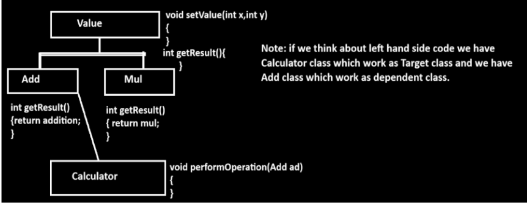

Q. What is Inheritance?

Inheritance is a mechanism in Java where one class acquires (inherits) the properties and behaviors of another class.

    The class whose properties are inherited is called the Parent class / Super class / Base class

    The class that inherits the properties is called the Child class / Sub class / Derived class

Definition (Standard) 

    Inheritance means transferring the properties (variables) and behaviors (methods) of one class into another class.

Note : 
IS–A Relationship

    When inheritance is performed between two classes, they are connected by an IS–A relationship.

    Example:
    Math IS-A Subject
    Dog IS-A Animal
    Car IS-A Vehicle

Q. Why use Inheritance? / What are the benefits of Inheritance?

Inheritance is used in Java to reuse existing code, extend functionality, and establish a relationship between classes.

Benefits of Inheritance
1️⃣ Reusability

Reusability means using the properties and methods of an existing class in another class.
    Common logic is written once in the parent class
    Child classes can reuse that logic
    Reduces code duplication
Example:
If multiple classes require calculator operations (ADD, SUB, MUL, DIV), we can define them in one parent class and reuse them in child classes.

2️⃣ Extensibility

Extensibility means the child class can extend the functionality of the parent class.

    Child class acquires parent properties
    Child class can add new variables and methods
    Existing code remains unchanged

Example:

class Calculator
{
    void add() { }
    void sub() { }
}

class AdvancedCalculator extends Calculator
{
    void mul() { }
    void div() { }
}

3️⃣ Abstraction

Inheritance helps in achieving abstraction by:

    Showing only required features
    Hiding unnecessary details

(Concept explained later using abstract classes and interfaces)

4️⃣ Dynamic Polymorphism

Inheritance is required to achieve runtime polymorphism.

    Parent reference can refer to child object
    Method overriding allows dynamic method binding

(Explained later in polymorphism topic)

Summary Table
| Benefit       | Description                               |
| ------------- | ----------------------------------------- |
| Reusability   | Write once, use multiple times            |
| Extensibility | Add new features without modifying parent |
| Abstraction   | Hides internal implementation             |
| Polymorphism  | Enables dynamic behavior                  |

-------------------------------------------------------------------------Q. Types of Inheritance / How many ways to perform inheritance?

Inheritance can be performed in the following ways:

1️⃣ Single Level Inheritance

    When one parent class is inherited by one child class, it is called single level inheritance.

    Example:
        class A { }
        class B extends A { }

2️⃣ Multilevel Inheritance

    When a class is derived from another derived class, it is called multilevel inheritance.

    Here, a class acts as child of one class and parent of another.

    Example:
        class A { }
        class B extends A { }
        class C extends B { }

3️⃣ Hierarchical Inheritance

    When one parent class has more than one child class, it is called hierarchical inheritance.

    Example:
        class A { }
        class B extends A { }
        class C extends A { }

4️⃣ Multiple Inheritance

    When one child class inherits from more than one parent class, it is called multiple inheritance.

    ⚠️ Java does NOT support multiple inheritance using classes because of ambiguity problems.

    ✔ Java supports multiple inheritance using interfaces.

    Example (Interface-based):
        interface A { }
        interface B { }
        class C implements A, B { }

5️⃣ Hybrid Inheritance

    Hybrid inheritance is a combination of two or more types of inheritance. 

    ⚠️ Java does NOT support hybrid inheritance using classes,
    but it can be achieved using interfaces.

⭐ Important Java Note (Very Important for Exams)
| Type         | Supported in Java (Classes) |
| ------------ | --------------------------- |
| Single Level | ✅ Yes                       |
| Multilevel   | ✅ Yes                       |
| Hierarchical | ✅ Yes                       |
| Multiple     | ❌ No (with classes)         |
| Hybrid       | ❌ No (with classes)         |

-------------------------------------------------------------------------
Q. How to implement inheritance practically in Java?
-------------------------------------------------------------------------
Inheritance in Java is implemented using the *extends* keyword.

Using the extends keyword, a child class can acquire the properties and methods of a parent class.

Syntax of Inheritance
    class Parent
    {
        // variables and methods
    }

    class Child extends Parent
    {
        // child class variables and methods
    }
-------------------------------------------------------------------------
Q. Can we create a Java program without inheritance?
-------------------------------------------------------------------------
No, it is not possible to create a Java program without inheritance.

Reason:
In Java, every class is implicitly inherited from the Object class.
    If a developer does not explicitly extend any class,
    Java automatically provides a default parent class.
    This default parent class is java.lang.Object.
    Hence, inheritance is always present in Java programs.

class A
{

}

// compiler generated code
class A extends java.lang.object
{

}
-------------------------------------------------------------------------
Defined Class → Object Class
   Q. Why does Java provide an Object class as a parent class to every user defined class?
____________________

-------------------------------------------------------------------------
What is Object Class?
 
The Object class is the root class of Java.
    Every class in Java directly or indirectly inherits from the Object class
    It contains inbuilt methods that are required by every Java class for common operations
The Object class belongs to the java.lang package.

Important Methods of Object Class

| Method                       | Purpose                                 |
| ---------------------------- | --------------------------------------- |
| `boolean equals(Object obj)` | Compares two objects                    |
| `int hashCode()`             | Returns hash value of object            |
| `String toString()`          | Returns string representation of object |
| `Object clone()`             | Creates copy of object                  |
| `Class getClass()`           | Returns runtime class info              |
| `void wait()`                | Causes thread to wait                   |
| `void wait(long ms)`         | Waits for given time                    |
| `void notify()`              | Wakes up one waiting thread             |
| `void notifyAll()`           | Wakes up all waiting threads            |
| `void finalize()`            | Called before garbage collection        |

One-Line Exam Answer
    Object class is the superclass of all Java classes and provides common methods required for basic object operations.
---------------------------------------------------------------------------------
Q. Is Java a Pure Object-Oriented Language?
Short Answer:

❌ No, Java is not a pure object-oriented language.

Explanation:
    Java follows object-oriented principles, but it is not 100% pure OOP because:
    Reasons Java is NOT Pure OOP
        Java supports primitive data types
        (int, float, char, boolean, etc.)
        Primitive types are not objects
        Static methods and variables can exist without objects

        Why Some People Say Java is Pure OOP?
        Because:
            Everything is written inside a class
            Every class inherits from Object class
            Java provides wrapper classes (Integer, Float, etc.)
            No code can run outside a class
            Final Conclusion (Correct Answer)

Java is not a pure object-oriented language because it supports primitive data types, but it is strongly object-oriented.
---------------------------------------------------------------------------------
Example of Hirachical inheritance
---------------------------------------------------------------------------------
class Value 
{ 
    int x,y;
    void setValue(int x,int y)
    {  
        this.x=x;
        this.y=y;
    }
}
class Add extends Value 
{  
    int getAdd()
   { 
      return x+y;
   }
}
class Mul extends Value 
{  int getMul()
   { 
    return this.x*this.y;
   }
}
public class HApplication
{  public static void main(String x[])
   {   
       Add ad = new Add();
	   ad.setValue(10,20);
	   int result=ad.getAdd();
	   System.out.println("Addition is "+result);
	   Mul m = new Mul();
	   m.setValue(5,4);
	   result=m.getMul();
	   System.out.println("Multiplication is "+result);
   }
}

Output
    Addition is 30
    Multiplication is 20

----------------------------------------------------------------
Constructor with Inheritance
----------------------------------------------------------------
When a parent class has a default constructor and the child class has its own constructor, then on creating an object of the child class, the parent class constructor is executed first automatically, followed by the child class constructor.

class A
{
    A()
    {
        System.out.println("I am parent construoctor");
    }
}
class B extends A
{
    B()
    {
        super()
        System.out.println("I am child constructor");
    }
}
public class InhConsApp
{
    public static void main(String x[])
    {
        B b1 = new B();
    }
}

🖨️ Output:
I am parent constructor
I am child constructor

Note: Constructor with Parameterized Parent Class

When a parent class has a parameterized constructor and we create an object of the child class, then the child class constructor must pass parameters to the parent class constructor.
For this purpose, we use the super() constructor.

If parameters are not passed using super(), the program will produce a compile-time error, because Java will try to call a default constructor of the parent class, which does not exist.

class A
{
    A(int x)
    {
        System.out.println("I am parent constructor "+ x);
    }
}
class B extend A
{
    B()
    {
        System.out.println("I am child constructor");
    }
}
public class  InhConsApp
{
    public static void main(String x[])
    {
        B b1 = new b();
    }
}

output:
error

Key Points:
If we look at the left-hand side code, we get a compile-time error because the parent class contains a parameterized constructor.
When a parent class has a parameterized constructor, the Java compiler cannot automatically pass arguments to the parent constructor.

Therefore, it becomes the developer’s responsibility to explicitly pass parameters from the child class constructor to the parent class constructor.

For this purpose, Java provides the super() constructor, which must be used inside the child class constructor to pass the required arguments to the parent constructor.

-------------------------------------------------------------------------

Q. What is super() constructor and why is it used?

The super() constructor is an inbuilt constructor call used inside a child class constructor to call or refer to the parent class constructor.

Why do we use super() constructor?

    It is used to invoke the parent class constructor from the child class constructor.
    It is mandatory when the parent class has a parameterized constructor.
    It helps in passing parameters from child to parent constructor.
    It ensures proper initialization of parent class data members.

Important Points:

    super() is written inside the child class constructor.
    super() must be the first statement in the constructor.
    If the parent class has only a default constructor, Java calls super() implicitly.
    Using super() enables constructor chaining in inheritance.

class A
{
    A(int x)
    {
        System.out.println("I am parent constructor "+x);
    }
}
class B extends A
{
    B()
    {
        super(100);
        System.out.println("I am child constructor");
    }
}
public class InhConsApp
{
    public static void main(String x[])
    {
        B b1 = new B();
    }
}

🖨️ Output
I am constructor 100
I am child constructor

NOTE : super() must be first line of code in child class constructor but jdk 24 we can write super on any line

NOTE: you can compile and run java code as per given format so we can use super() constructor on any line

class A
{
    A(int x)
    {
        System.out.println("I am construtor "+x);
    }
}
class B extends A
{
    B()
    {
        System.out.println("I am child constructor ");
        super(100);
    }
}
public class InchConsApp
{
    public static void main(String x[])
    {
        B b1 = nwe B();
    }
}

🖨️ Output
I am constructor 100
I am child constructor
------------------------------------------------------------------------
Q. How is the default constructor of a parent class called automatically by a child class?
------------------------------------------------------------------------

When the parent class has a default (no-argument) constructor, the Java compiler automatically inserts a super() call as the first line inside the child class constructor.   
Therefore, the developer does not need to call super() manually.
Because of this implicit super() call, the parent class default constructor is executed first, followed by the child class constructor.

Key Points:
    Compiler inserts super() automatically
    super() calls the parent default constructor
    No need to write super() explicitly
    Parent constructor executes before child constructor
-------------------------------------------------------------------------
Q. Is super() called a grandparent class constructor?
-------------------------------------------------------------------------
Answer: No.
    super() does not directly call the grandparent class constructor.
    It can only call the immediate parent class constructor.

Explanation:
    super() is used to invoke the constructor of the immediate parent class only.

Java follows constructor chaining.
    When super() is called in a child class constructor:
    It first calls the parent class constructor
    If that parent constructor contains super(), then it calls its parent constructor, and so on.
    Thus, the grandparent constructor is called indirectly, not directly.

class D
{
    D(int x)
    {
        System.out.println("I am D constructor " + x);
    }
}
class A extends D
{
    A(int x)
    {
       // super(x);   // mandatory
        System.out.println("I am parent constructor " + x);
    }
}
class B extends A
{
    B()
    {
        super(100);   // calls A(int)
        System.out.println("I am child constructor");
    }
}
public class InhConsApp
{
    public static void main(String x[])
    {
        B b1 = new B();
    }
}

Corrected Note:

Note:
    If we look at the left-hand side, we get a compile-time error because we do not pass any parameter to the constructor D(int x) from class A.
    In class B, we call super(100), which invokes the constructor of the immediate parent class A, not the grandparent class D.
    Since super() can call only the immediate parent constructor, and class A does not explicitly call super(x) for class D, the compiler cannot find a valid constructor to execute.
    To resolve this error, we must explicitly call super(x) inside the constructor of class A.

Correct version of above code

class D
{
    D(int x)
    {
        System.out.println("I am D constructor "+x);
    }
}
class A extends D
{
    A(int x)
    {
        super(200); //call D
            System.out.println("I am parent construtor "+x);
    }
}
class B extends A
{
    B()
    {
        super(100); //call A
        System.out.println("I am child constructor");
    }
}
public class InhConsApp
{
    public static void main(String x[])
    {
        B b1 = new B();
    }
}

🖨 Output
I am D constructor 200
I am parent construtor 100
I am child constructor

Q. What is the difference between this() and super() constructors?
| `this()` constructor                                     | `super()` constructor                                              |
| -------------------------------------------------------- | ------------------------------------------------------------------ |
| Refers to the **current class constructor**              | Refers to the **parent class constructor**                         |
| Used for **constructor chaining within the same class**  | Used for **constructor chaining between parent and child classes** |
| Works with **constructor overloading** in the same class | Works with **inheritance**                                         |
| Calls another constructor of the **same class**          | Calls a constructor of the **immediate parent class**              |
| Helps avoid **duplicate initialization code**            | Helps initialize **parent class data**                             |

-------------------------------------------------------------------
Q. Can we use this() and super() at the same time?
-------------------------------------------------------------------
Answer: No.
    We cannot use this() and super() together in the same constructor.

Explanation:
    Both this() and super() must be the first statement in a constructor.
    Java allows only one first statement in a constructor.

Note: but if we  use – - enable-preview option with new JDK version then it is possible 
 
Final keyword : final keyword can use with variable, with function and with class and final is non access specifier 

-------------------------------------------------------------------------
Q. What is a non-access specifier?
-------------------------------------------------------------------------
Answer:
    Non-access specifiers are Java keywords used to define the behavior or restrictions of a class, method, or variable.
    They control how a member works, not who can access it.

Types of non-access specifiers:
    a. static
    b. final
    c. abstract
    d. synchronized
    e. volatile
    f. transient
    g. strictfp
    h. assert

Q. What is an access specifier?
Answer:
    Access specifiers are Java keywords used to control the accessibility (visibility) of classes and their members.

Types of access specifiers:
    public
    protected
    default (no keyword)
    private

Difference in One Line (Exam Tip):
    Access specifiers → control visibility
    Non-access specifiers → control behavior

Final Variable

A final variable is a variable whose value cannot be changed once it is assigned.
It is used to create constants in Java.

Example:
calss A
{
    private int m;
    final int n = 10;
}
public class InhConsApp
{ 
    public static void main(String x[])
    {
        A a1 = new A();
        a1.n++;
        System.out.printf("N = %n"a1.n);
    }
}
NOTE : we get compile time errror because we try to modifiy value of final variable which is not possible
means final can use for only constnat declaration purpose

------------------------------------------------------------------------
Q. What is method overriding?
-----------------------------------------------------------------------
Answer:
    Method overriding means when define method in parent class and redefine same method again in child class with same signature /syntax  called as overriding 

    Method overriding occurs when a child class provides its own implementation of a method that is already defined in the parent class, using the same method signature.

Conditions for Method Overriding:
    For overriding, the following must be same in both parent and child classes:
    1.Method name
    2.Parameter list (number, type, and sequence)

🔹 Return type must be the same or covariant (subclass type).
🔹 Access modifier cannot be more restrictive than the parent’s.

Important Points:
    Method overriding supports runtime polymorphism.
    Overriding happens only in inheritance.
    Only non-static methods can be overridden.
    final, static, and private methods cannot be overridden.

class A
{
    void show()
    {
        System.out.println("I am show in A");
    }
}
class B extends A
{
    void show()
    {
        System.out.println("I am show in B");
    }
}

NOTE: same Syntax or signature in parent and child it is overriding
------------------------------------------------------------------------
NOTE: in the case of method overriding when we create an object of child class and try to call an overridden method then by default child logics get executed.

class A
{
    void show()
    {
        System.out.println("I am in A");
    }
}
class B extends A
{
    void show()
    {
        System.out.println("I am show in B");
    }
}
public class InhConsApp
{
    public static void main(String x[])
    {
        B b1 = new B();
        b1.show();
    }
}

✔ Output
I am show in B
-----------------------------------------------------------------------
Q. Why do we use method overriding? / What are the benefits of overriding?
------------------------------------------------------------------------
Method overriding is used to:
    1. Customize parent class method logic in the child class according to child requirements.
    2. Achieve dynamic (runtime) polymorphism.
    3. Provide specific behavior for different child classes while keeping a common interface.

Explanation with Real-World Example (Loan Module)

    Suppose we have a Loan module in a banking application.
    There are different types of loans:
        Home Loan
        Car Loan
    Some rules are common for all loans (documents, eligibility, etc.).
    But loan tenure differs:
        Home Loan → maximum 30 years
        Car Loan → maximum 7 years

    To implement this:
        Create a parent class Loan
        Define a method like getTenure()
        Override this method in child classes to customize logic

example with source code

class Loan
{
   void loanCompDoc()
   {   
        System.out.println("Need to submit salary sleep or 3 year tax returns");
   }
   void loanFlexDoc()
   {
   }
   int getTenuar()
   {
        return 0;
   }
}
class Home extends Loan 
{  
    int getTenuar()
    {
        return 30;
    }
}
class Car extends Loan 
{
    int getTenuar()
    {
        return 7;
    }
}
public class LoanApplication
{   
    public static void main(String x[])
    {
	   Home h = new Home();
	   h.loanCompDoc();
	   int max = h.getTenuar();
	   System.out.println("Max Tenuar for Home loan refundation "+max);
	   Car c = new Car();
	   c.loanCompDoc();
	   max = c.getTenuar();
	   System.out.println("Max tenuar for Car loan refundation "+max);
	}
}
------------------------------------------------------------------------
How can we achieve dynamic polymorphism using overriding?
------------------------------------------------------------------------
Q. What is dynamic polymorphism?
Answer:
    Dynamic polymorphism occurs when the method call is resolved at runtime based on the object, not the reference type.
    It is achieved through method overriding.
    In dynamic polymorphism, which child class method is executed is decided at program runtime.  

Important Points:
    Also called runtime polymorphism
    Achieved using method overriding
    Requires inheritance
    Method binding happens at runtime
    Implemented using upcasting

Upcasting (Very Important)
Upcasting:
When a parent class reference refers to a child class object, it is called upcasting.

    Parent p = new Child(); // upcasting 

Benefit of Upcasting:
    We can change child object at runtime 
    Enables dynamic polymorphism 
-----------------------------------------------------------------------
Example: Calculator using Dynamic Polymorphism

class Value 
{   
   int x,y;
   void setValue(int x,int y) 
   {
        this.x=x;
        this.y=y;
   }
   int getResult()
   {
      return 0;
   }
}

class Add extends Value
{
    int getResult()
    {
        return x+y;
    }
}

class Mul extends Value 
{  
    int getResult()
    {
      return x*y;
    }
}

public class DPAPP
{ 
  public static void main(String x[])
  {
	  Value v = null;
      
	  v = new Add();
	  v.setValue(10,20);
	  int result = v.getResult();
	  System.out.println("Addition is "+result);

	  v = new Mul();
	  v.setValue(5,4);
	  result = v.getResult();
	  System.out.println("Multiplication is "+result);
  }
}

Example: we want to calculate area  and circum of circle and we have following class hierarchy 

class Circle
{
    float radius;

    void setRadius(float radius)
    {
        this.radius = radius;
    }

    float getResult()
    {
        return 0;
    }
}

class Area extends Circle
{
    float getResult()
    {
        return radius * radius * 3.14f;
    }
}

class Cirm extends Circle
{
    float getResult()
    {
        return radius * 2 * 3.14f;
    }
}

public class CircleApplication
{
    public static void main(String x[])
    {
        Circle c = null;

        c = new Area();          // parent reference → child object
        c.setRadius(3.0f);
        float result = c.getResult();   // calls Area.getResult()
        System.out.println("Area " + result);

        c = new Cirm();          // parent reference → different child
        c.setRadius(4.0f);
        result = c.getResult();  // calls Cirm.getResult()
        System.out.println("Circumference " + result);
    }
}

Q. What is the benefit of dynamic polymorphism with upcasting technique?

Answer:
The main benefit of dynamic polymorphism with upcasting is to achieve loose coupling.

Using upcasting, a parent class reference can refer to different child class objects, and the method call is resolved at runtime.
This allows us to write flexible and extensible code without depending on concrete implementations.

-------------------------------------------------------------------
Q. What is coupling in OOP?

Answer:
Coupling in Object-Oriented Programming refers to the degree of dependency between two classes.

If one class depends heavily on another class to perform its operations, then those classes are said to be tightly coupled.

In other words, when:
    One class cannot work independently
    Or one class directly creates or uses another class object
    then coupling exists.

Types of Classes in Coupling
1️⃣ Target Class
    A target class is the class whose object is created and which internally uses another class.
    ➡ When an object of the target class is created, another class object gets used automatically.
  
2️⃣ Dependent Class
    A dependent class is the class that is used by the target class.
    ➡ The dependent class cannot function independently and always works in association with the target class.

class Parcel
{
    private int id;
    private String name;
    private int weight;

    // setters
    void setId(int id)
    {
        this.id = id;
    }

    void setName(String name)
    { 
        this.name = name;
    }

    void setWeight(int weight)
    {
        this.weight = weight;
    }

    // getters
    int getId()
    {
        return id;
    }

    String getName()
    {
        return name;
    }

    int getWeight()
    {
        return weight;
    }
}

class Courier   // Target class
{
    private Parcel parcel;

    void setParcel(Parcel parcel)
    {
        this.parcel = parcel;   // dependency injected
    }
 
    void show()
    {
        System.out.println("Parcel Id: " + parcel.getId());
        System.out.println("Parcel Name: " + parcel.getName());
        System.out.println("Parcel Weight: " + parcel.getWeight()); 
    }
}

public class CoupApplication
{
    public static void main(String x[])
    {
        Parcel p = new Parcel();
        p.setId(1);
        p.setName("ABC");
        p.setWeight(100);

        Courier c = new Courier();
        c.setParcel(p);   // object association
        c.show();
    }
}
output:
Parcel Id: 1
Parcel Name: ABC
Parcel Weight: 100
----------------------------------
Types of Coupling

1️⃣ Tight Coupling
Definition:
Tight coupling occurs when a target class  is completely dependent (100%) on a specific dependent class. Any change in the dependent class directly affects the target class.

Key Points:
    Direct object creation using new
    Target class depends on concrete class
    Hard to modify, test, or extend
    Low reusability

2️⃣ Loose Coupling
Definition:
Loose coupling occurs when a target class is partially dependent on another class, usually through a parent class reference  as parameter in target class.(interface or superclass).

Key Points:
    Uses interface or superclass reference
    Object passed via constructor or method
    Easy to change implementation
    High flexibility and reusability

example of Tight coupling?


class Value 
{
    int x, y;

    void setValue(int x, int y)
    {
        this.x = x;
        this.y = y;
    }

    int getResult()
    {
        return 0;
    }
}

class Add extends Value
{
    int getResult()
    {
        return x + y;
    }
}

class Mul extends Value
{
    int getResult()
    {
        return x * y;
    }
}

class Calculator
{
    void performOperation(Add ad)
    {
        int result = v.getResult();
        System.out.println("Result is " + result);
    }
}

public class CalcApplication
{
    public static void main(String x[])
    {
        Calculator c = new Calculator();

        Add a = new Add();
        a.setValue(10, 20);
        c.performOperation(a);

        Mul m = new Mul();
        m.setValue(5, 4);
        c.performOperation(m);
    }
}

🖨️ Output
Result is 30
Result is 20

✅ Correct Explanation (Improved & Structured)

In the given code, compile-time error occurs because the Calculator class contains the method:
    performOperation(Add ad)
This method accepts only an Add class reference.
Now, from the main() method, we try to pass a Mul class object:
    c.performOperation(m);   // m is Mul object
This is not allowed, because:
Mul is not of type Add
Java does not support implicit conversion between sibling classes
As a result, the compiler throws a compile-time error.

❌ Why this is Tight Coupling
    Calculator is directly dependent on the concrete class Add
    performOperation(Add ad) cannot work with any other operation
    If we want multiplication, subtraction, etc., we must change Calculator code

📌 Key Points (Exam Friendly)
    performOperation(Add ad) works only with Add objects
    Cannot accept Mul, Sub, or any other class
    Causes compile-time error
    Violates polymorphism
    Reduces reusability and flexibility

If we want to resolve the problem of tight coupling we have two solutions or two ways 
--------------------------------------------------------
a.Using compile time polymorphism

    🔹 Resolving tight coupling using Compile-Time Polymorphism (Method Overloading)

    One way to reduce the tight coupling problem in the given program is by using compile-time polymorphism, i.e., method overloading.

    In this approach, we overload the performOperation() method in the Calculator class:

    One version accepts an Add object

    Another version accepts a Mul object

    This allows the Calculator class to work with both Add and Mul objects.
-------------------------------------------------
```java
class Value
{ 
  int x,y;
  void setValue(int x,int y)
  {  
    this.x=x;
    this.y=y;
  }
  int getResult()
  {  
    return 0;
  }
}
class Add extends Value 
{
   int getResult()
   { 
     return x+y;
   }
}
class Mul extends Value
{
    int getResult()
   { 
     return x*y;
   }
}
class Calculator 
{
   void performOperation(Add ad)
   {  
      int result=ad.getResult();
      System.out.printf("Result is %d\n",result);
   }
    void performOperation(Mul m)
   {  
      int result = m.getResult();
      System.out.printf("Result is %d\n",result);
   }
}
public class CalcApplication
{ 
   public static void main(String x[])
   {
      Calculator c = new Calculator();
	  Add ad = new Add();
	  ad.setValue(10,20);
	  c.performOperation(ad);
	  Mul m = new Mul();
	  m.setValue(5,4);
	  c.performOperation(m);
   }
}

🖨️ Output of the Program
Result is 30
Result is 20
```

✅ Limitation of Compile-Time Polymorphism (Method Overloading)

Although we can resolve the tight coupling problem using compile-time polymorphism (method overloading), this approach has serious limitations.

🔹 Problem Scenario
Suppose:
    The Calculator class supports 100 different operations
    Add, Mul, Div, Sub, Pow, Square, etc.  
    Each operation is implemented in a separate class
    To support all operations using method overloading, the Calculator class must define:

performOperation(Add a)
performOperation(Mul m)
performOperation(Div d)
performOperation(Sub s)
...
// nearly 100 overloaded methods

❌ Why this approach fails in real-world systems
    Calculator becomes very bulky
    High code duplication
    Violates Open–Closed Principle
    Every new operation requires
    Modifying Calculator
    Adding another overloaded method

Not scalable
Difficult to maintain and test

👉 Hence, method overloading is not practical for large systems.

✅ Why Dynamic Polymorphism is the Best Solution    
To solve this limitation, we use dynamic (runtime) polymorphism.

🔹 Key idea:
    Use parent class reference to refer to child class objects
    Use method overriding
    Create one generic method that behaves like 100 methods
    void performOperation(Value v)

At runtime:
    If v refers to Add → addition is performed
    If v refers to Mul → multiplication is performed
    If v refers to Div → division is performed
    ✔ Method selection happens at runtime
    ✔ Achieves true loose coupling
----------------------------------------------
class Circle
{  
   float radius;
   void setRadius(float radius)
   {    
      this.radius = radius;
   }
   float getResult()
   {  
      return 0.0f;
   }
}
class Area extends Circle 
{
   float getResult()
   {
      return radius*radius*3.14f;
   }
}
class Cirm extends Circle 
{
   float getResult()
   {
      return 2*radius*3.14f;
   }
}
class CircleCalculator
{
    void calResult(Circle c)
	{  
       float result = c.getResult();
	   System.out.println("Result is "+result);
	}
}

public class CircleCalculatorApplication
{
    public static void main(String x[])
	{
	   CircleCalculator cc = new CircleCalculator();
	   Circle c = new Area();
	   c.setRadius(3.0f);
	   cc.calResult(c);// behave as circle area 
	   c = new Cirm();
	   c.setRadius(4.0f);
	   cc.calResult(c);//behave as cirm 
	}
}
Output:
Result is 28.26
Result is 25.12

-------------------------------------------------------------------
Q. Is method overriding beneficial or not?

Answer:
Some time is beneficial and some time not it is dependent on requirement of project 
-----------------------------------------------------------------
Q. How can we avoid method overriding or What is the goal of the final method ?

We can avoid method overriding by declaring the parent class method as final.

A final method cannot be overridden, so the child class cannot modify the logic of the parent class method.

👉 The main goal of a final method is to protect the parent class logic from being changed by child classes.

Class A
{
    final void show()
    {
        System.out.println("I am show in A");
    }
}
class B extends A
{
    void show()
    {
        System.out.println("I am show in B");
    }
}
public class InhConsApp
{
    public static void main(String x[])
    {
        B b1 = new B();
        b1.show();
    }
}

output:
show() in B cannot override show() in A
overridden method is final
---------------------------------------------------------------
❓ Q. What is a Final Class?

    A final class is a class that cannot be inherited.
    No other class can extend a final class.
    Final class has no child class.

🔹 Purpose / Goal
    To create immutable classes
    Immutable class → its state/value cannot be changed once assigned
    To provide security
    Prevents modification by inheritance
    To ensure consistency
    Useful when you want stable behavior that cannot be overridden

If we think about JAVA API String class is final class so in java string is immutable class 

final class A
{
    void show()
    {
        System.out.println("I am show method");
    }
}
class B extend A
{

}
public class FCAPP
{
    public static void main(String x[])
    {
        B b1 = new B();
        b1.show();
    }
}

output
❌ Compile-time Errors You’ll Get
cannot inherit from final A
cannot find symbol: extend


✅ Option 1: If you WANT inheritance → remove final
✅ Option 2: If class MUST be final → no inheritance  allowed

Note: final class is recommended in two cases 
    1.When we avoid inheritance 
    2.When developer want to create immutable classes in  JAVA
---------------------------------------------------------
Steps to create immutable class in java 
✅ Steps to Create an Immutable Class in Java

An immutable class is a class whose objects cannot be modified after creation.

🔹 Step 1: Declare the class as final

    This prevents inheritance, so no subclass can change the behavior.

    final class Employee
    {
    }

🔹 Step 2: Make all fields private and final

    private → fields cannot be accessed directly
    final → fields cannot be changed once initialized

    final class Employee
    {
        private final int id;
        private final String name;
    }

🔹 Step 3: Do NOT provide setter methods

    Setters allow modification, which breaks immutability.
    ❌ No setId()
    ❌ No setName()

🔹 Step 4: Initialize all fields using a constructor

    All values must be assigned only once, during object creation.

    final class Employee
    {
        private final int id;
        private final String name;

        public Employee(int id, String name)
        {
            this.id = id;
            this.name = name;
        }
    }

🔹 Step 5: Provide only getter methods

    Getters allow read-only access to data.

    final class Employee
    {
        private final int id;
        private final String name;

        public Employee(int id, String name)
        {
            this.id = id;
            this.name = name;
        }

        public int getId()
        {
            return id;
        }

        public String getName()
        {
            return name;
        }
    }

Q. What is the difference between final method and final class?
________________________________________________________
| Feature           | Final Method          | Final Class                     |
| ----------------- | --------------------- | ------------------------------- |
| Can be inherited  | ✅ Yes               | ❌ No                           |
| Can be overridden | ❌ No                | ❌ No inheritance               |
| Used to prevent   | Method overriding     | Class inheritance               |
| Main purpose      | Protect method logic  | Provide security / immutability |
| Example use       | Secure parent methods | `String` class                  |


Q. What is the difference between static and final methods?

Static Method vs Final Method in Java
🔹 Static Method
    A static method belongs to the class, not to the object.
    Memory for a static method is allocated at class loading time, before any object of the class is created.
    A static method can only access static variables and static methods directly.
    It cannot access instance variables directly because instance variables belong to objects.

Static Method & Overriding
    Static methods cannot be overridden.
    If a child class defines a static method with the same signature as the parent class, it is called method hiding, not method overriding.
    There is no compile-time error, but runtime polymorphism does not work for static methods.
    ✅ This is why static methods are said to support method hiding, not overriding.

🔹 Final Method
    A final method is used to prevent method overriding.
    A final method cannot be overridden in the child class.
    If we try to override a final method, we get a compile-time error.
    A final method can be:
        Static variables
        Instance variables
        (if the final method itself is not static)

| Feature                        | Static Method                 | Final Method                            |
| ------------------------------ | ----------------------------- | --------------------------------------- |
| Belongs to                     | Class                         | Class Object                            |
| Memory allocation              | At class loading time         | At object creation time (if non-static) |
| Can access instance variables  | ❌ No                          | ✅ Yes (if non-static)                   |
| Overriding                     | ❌ Not allowed (Method Hiding) | ❌ Not allowed                           |
| Compile-time error on override | ❌ No                          | ✅ Yes                                   |
| Polymorphism                   | ❌ No                          | ❌ No                                    |


 class A
 {
    static void show()
    {
    }
 }
 class B extend A
 {
    static void show()
    {
    }
 }

 Note:it look like as overriding but it is method hiding concept and no compile time error

 class A
 {
    final void show()
    {
    }
 }
 class B extends A
 {
    void show()
    {
    }
 }

 NOTE: we get compile time error because we try to override show() in child class B.

 class A
 {
    static int m;
    int n;
    final void show()
    {
        System.out.println("M is "+m+"\t N is"+n);
    }
 }

 Note: if we think about above code ther is no compile time error because final non static method can allow static as well as instance variable in his block

 Note: if we think given code we get compile time error because we try to access instance variable instatic function block

 class A
 {
    static int m;
    int n;

    static void show()
    {
        System.out.println("M is "+m+"\t N is "+n)
    }
 }
 Note: you can use static and final keyword at same time with variable as well as method also 
 


