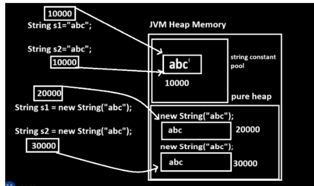

---

# 🔹 Wrapper Classes in Java

### ✔ Definition

Wrapper classes are **(inbuild)predefined classes in Java** that convert:

* **Primitive data type → Object (Reference data type)**
* **Object (Reference data type) → Primitive data type**

Example:

* `int` → `Integer`
* `float` → `Float`
* `char` → `Character`

---

# 🔹 Primitive Type Conversion

 primitive conversion means perform conversion between simple data type called as primitive conversion 
Like as int to float  ,float to int etc 


### 1. Implicit Conversion (Widening)

* Done automatically by compiler
* Smaller → Larger type

```java
int a = 100;
long b = a;   // implicit conversion
```

---

### 2. Explicit Conversion (Narrowing)

* Done manually using casting
* Larger → Smaller type

```java
long b = 20;
int a = (int) b;   // explicit conversion
```

---

# ⚠️ Important Correction

 you cannot directly cast a String to a primitive int using simple casting (int). This is because a String is a reference object, while an int is a primitive type.
To resolve this, Java provides Wrapper Classes (like Integer) that contain helper methods for these conversions.
------------------------------
## Understanding the Problem
In the code shown, int b = (int) s; fails because the compiler doesn't know how to mathematically "cast" text into a number.
## How to Fix It
You need to parse the string. Here are the three most common ways to convert a String to an integer:

| Method             | Code Example                      | Note                                            |
|---                 |---                                |---                                              |
| Integer.parseInt() | int b = Integer.parseInt(s);      | Returns a primitive int. Best for most cases.   |
| Integer.valueOf()  | Integer b = Integer.valueOf(s);   | Returns an Integer object.                      |
| Scanner class      | int b = new Scanner(s).nextInt(); | Useful if the string contains multiple numbers. |

## Corrected Code Example
```
public class CAPP 
{
    public static void main(String[] args) 
    {
        String s = "1234";

        int b = Integer.parseInt(s);
        
        System.out.println("b is : " + b);
    }
}
```
## Key Concepts to Remember

* Wrapper Classes: Every primitive type has a corresponding class (e.g., int $\rightarrow$ Integer, double $\rightarrow$ Double).
* Parsing: This is the process of analyzing a string of symbols and converting them into a data format the program can use.
* NumberFormatException: If your string s contained letters (like "123a"), the methods above would throw this error because the text cannot be turned into a number.

Would you like to see how to handle cases where the string might contain non-numeric characters?

✔ Correct version:

* Primitive ↔ Wrapper conversion is **NOT done using casting**
* It is done using:

  * **Autoboxing**
  * **Unboxing**

  

---

# 🔹 Wrapper Class Conversion

### ✔ 1. Autoboxing

Primitive → Object(referencial datatype)

```java
int a = 100;
Integer b = a;   // correct (not Long)
```

⚠️ Your mistake:

```java
Long b = a;  // ❌ wrong (int → Integer, not Long)
```

---

### ✔ 2. Unboxing

Object(referencial datatype) → Primitive

```java
Integer b = 200;
int a = b;   // correct
```

⚠️ Your mistake:

```java
Int a = b;   // ❌ 'Int' is invalid, use 'int'
```

---

Sometime autoboxing and autounboxing not works when we have different type primitive data and different type of referential numeric data then we have Number class which provide some method to us for conversion between numeric reference and primitive type 

# 🔹 Number Class

* `Number` is an **abstract class**
* Parent of all numeric wrapper classes (`Integer`, `Float`, etc.)

### Useful Methods:
this method is used for convert referential numeric value to primitive data type 
```java
int intValue() 
float floatValue()
double doubleValue()
long longValue()
short shortValue()
byte byteValue()
```

Example:

```java
Integer obj = 100;

byte b = obj.byteValue();
short s = obj.shortValue();
int a = obj.intValue();
long l = obj.longValue();
float f = obj.floatValue();
double d = obj.doubleValue();


```

---

# 🔹 valueOf() Method

* Converts primitive → object(Reference data type)

```java
int a = 10;
Integer i = Integer.valueOf(a);
String str = String.valuof(a);
Float f = Float.vlaueof(a);
```

---

# 🔹 parseXXX() Method

* Converts String → primitive

```java
String s = "1234";
int val = Integer.parseInt(s);
float f = Float.parseFloat(s);
System.out.println(val);  // 1234
System.out.println(f);    // 1234.0
```
⚠️ Important Points
1. String must be numeric
String s = "abc";
int val = Integer.parseInt(s); // ❌ Error

➡️ Throws: NumberFormatException

2. Float can accept decimal values
String s = "12.5";

float f = Float.parseFloat(s); // ✔ Works
int val = Integer.parseInt(s); // ❌ Error

3. No spaces allowed
String s = " 1234 ";
int val = Integer.parseInt(s); // ❌ Error

✔ Fix:

int val = Integer.parseInt(s.trim());

⚠️ May throw:

* `NumberFormatException`

---

# 🔹 String toString() Method

Convert any value → String

🔹 Example with Object

Integer obj = 100;
String s = obj.toString();
System.out.println(s);  // "100"

```java
int a = 10;
String s = String.valueOf(a);
```

---

# 🔹 String in Java

### ✔ Definition

* String is **immutable object in java**
* Once created, value **cannot change**
 when we perform any operation on string JVM create new object of string every time. Interally String is final class in JAVA.

Note: every  “ “ in java consider as string object 

---

# 🔹 String Creation

### 1. Using Literal

```java
String s = "abc"; s = reference of string and abc = object;
```
* Stored in **String Constant Pool**

---

### 2. Using new keyword

```java
String s = new String("abc");
```

* Stored in **Heap**

---

# 🔹 String Constant Pool (SCP)

* Special memory inside heap
* Stores unique string literals

Example:

```java
String s1 = "abc";
String s2 = "abc";
```

✔ Both refer to **same object**



When we create string using initialization then string object get create in string constant pool and when we have string with same value then JVM create single object in string constant and pool and share its address in multiple reference and 
when we create object using a new keyword then JVM create new object every time in heap if string value is same or different 

---
# String Constructors in Java

In Java, the `String` class provides different constructors to create string objects in various ways.

---

# 1. `String()`

## Definition

Creates an empty string object.

## Syntax

```java id="strcon1"
String s = new String();
```

## Example

```java id="strcon2"
public class Test {

    public static void main(String args[]) {

        String s = new String();

        System.out.println("String is: " + s);
    }
}
```

## Output

```id="out1"
String is:
```

---

# 2. `String(String)`

## Definition

Creates a string object with initial or default value.

## Syntax

```java id="strcon3"
String s = new String("Java");
```

## Example

```java id="strcon4"
public class Test {

    public static void main(String args[]) {

        String s = new String("Java");

        System.out.println("String is: " + s);
    }
}
```

## Output

```id="out2"
String is: Java
```

---

# 3. `String(char[])`

## Definition

Converts character array into string format.

## Syntax

```java id="strcon5"
char ch[] = {'J','A','V','A'};

String s = new String(ch);
```

## Example

```java id="strcon6"
public class Test {

    public static void main(String args[]) {

        char ch[] = {'J','A','V','A'};

        String s = new String(ch);

        System.out.println("String is: " + s);
    }
}
```

## Output

```id="out3"
String is: JAVA
```

---

# 4. `String(char[], int offset, int length)`

## Definition

Converts specified length of character array into string format.

---

## Parameters

| Parameter | Meaning               |
| --------- | --------------------- |
| `char[]`  | Actual character data |
| `offset`  | Starting index        |
| `length`  | Number of characters  |

---

## Syntax

```java id="strcon7"
char ch[] = {'J','A','V','A'};

String s = new String(ch,1,2);
```

---

## Example

```java id="strcon8"
public class Test {

    public static void main(String args[]) {

        char ch[] = {'J','A','V','A'};

        String s = new String(ch,1,2);

        System.out.println("String is: " + s);
    }
}
```

## Explanation

* Start index = 1 → `A`
* Length = 2 → `AV`

## Output

```id="out4"
String is: AV
```

---

# 5. `String(byte[])`

## Definition

Converts byte array into string format using ASCII values.

---

## Syntax

```java id="strcon9"
byte b[] = {65,66,67};

String s = new String(b);
```

---

## Example

```java id="strcon10"
public class Test {

    public static void main(String args[]) {

        byte b[] = {65,66,67,68};

        String s = new String(b);

        System.out.println("String is: " + s);
    }
}
```

## ASCII Values

| ASCII | Character |
| ----- | --------- |
| 65    | A         |
| 66    | B         |
| 67    | C         |
| 68    | D         |

## Output

```id="out5"
String is: ABCD
```

---

# 6. `String(byte[], int offset, int length)`

## Definition

Converts specified length of byte array into string format.

---

## Parameters

| Parameter | Meaning          |
| --------- | ---------------- |
| `byte[]`  | Actual byte data |
| `offset`  | Starting index   |
| `length`  | Number of bytes  |

---

## Syntax

```java id="strcon11"
byte b[] = {65,66,67,68};

String s = new String(b,1,2);
```

---

## Example

```java id="strcon12"
public class Test {

    public static void main(String args[]) {

        byte b[] = {65,66,67,68};

        String s = new String(b,1,2);

        System.out.println("String is: " + s);
    }
}
```

## Explanation

* Start index = 1 → 66 = B
* Length = 2 → BC

## Output

```id="out6"
String is: BC
```

---

# Summary Table

| Constructor                    | Purpose                           |
| ------------------------------ | --------------------------------- |
| `String()`                     | Creates empty string              |
| `String(String)`               | Creates string with initial value |
| `String(char[])`               | Converts char array to string     |
| `String(char[],offset,length)` | Converts part of char array       |
| `String(byte[])`               | Converts byte array using ASCII   |
| `String(byte[],offset,length)` | Converts part of byte array       |

---

# Important Notes

1. String objects are immutable in Java
2. String class belongs to `java.lang` package
3. Strings can be created using:

   * Constructor
   * Literal method

---

# Example of String Literal

```java id="literal1"
String s = "Java";
```

---

# Difference Between Constructor and Literal

| Constructor                        | Literal                        |
| ---------------------------------- | ------------------------------ |
| Creates object using `new` keyword | Direct assignment              |
| Memory allocated in heap           | Stored in String Constant Pool |
| Example: `new String("Java")`      | Example: `"Java"`              |


# 🔹 Important String Methods

```java

length()
charAt(int index)
toUpperCase()
toLowerCase()
concat(String)
trim()
substring(int start)
substring(int start, int end)
split(String)
indexOf(String)
startsWith(String)
endsWith(String)
```

---
# Methods of String in Java

The `String` class provides many inbuilt methods for performing operations on strings.

---

# 1. `int length()`

## Definition

This method is used to calculate the length of a string.

## Syntax

```java id="len1"
int len = s.length();
```

## Example

```java id="len2"
public class SMApplication {

    public static void main(String x[]) {

        String s = "Good";

        int len = s.length();

        System.out.println("Length is " + len);
    }
}
```

## Output

```id="lenout1"
Length is 4
```

---

# 2. `char charAt(int index)`

## Definition

This method returns character using specified index.

## Syntax

```java id="char1"
char ch = s.charAt(index);
```

## Example

```java id="char2"
public class SMApplication {

    public static void main(String x[]) {

        String s = "Java";

        char ch = s.charAt(2);

        System.out.println("Character is " + ch);
    }
}
```

## Output

```id="charout1"
Character is v
```

---

# 3. `String toUpperCase()`

## Definition

Converts string into uppercase and returns new string.

## Example

```java id="upper1"
public class SMApplication {

    public static void main(String x[]) {

        String s = "good";

        String s1 = s.toUpperCase();

        System.out.println("Original String : " + s);
        System.out.println("Upper String : " + s1);
    }
}
```

## Output

```id="upperout1"
Original String : good
Upper String : GOOD
```

---

# Why String is Immutable?

## Explanation

```java id="immut1"
String s = "good";

s.toUpperCase();
```

Here:

* Original object = `"good"`
* JVM creates new object = `"GOOD"`
* Original object is not modified

---

## Diagram Representation

```id="immutdiag"
Before:
s ----> "good"

After:
s ----> "GOOD"

Old object removed by Garbage Collector
```

So String objects are immutable.

---

# 4. `String toLowerCase()`

## Definition

Converts uppercase string into lowercase.

## Example

```java id="lower1"
public class SMApplication {

    public static void main(String x[]) {

        String s = "JAVA";

        String s1 = s.toLowerCase();

        System.out.println(s1);
    }
}
```

## Output

```id="lowerout1"
java
```

---

# 5. `String concat(String)`

## Definition

Used for combining two strings.

## Syntax

```java id="concat1"
String s3 = s1.concat(s2);
```

## Example

```java id="concat2"
public class SMApplication {

    public static void main(String x[]) {

        String s1 = "Good";
        String s2 = " Morning";

        String s3 = s1.concat(s2);

        System.out.println(s3);
    }
}
```

## Output

```id="concatout1"
Good Morning
```

---

# 6. `String trim()`

## Definition

Removes spaces from beginning and ending of string.

## Example

```java id="trim1"
public class SMApplication {

    public static void main(String x[]) {

        String s = "   Java   ";

        System.out.println(s.trim());
    }
}
```

## Output

```id="trimout1"
Java
```

---

# 7. `String substring(int index)`

## Definition

Extracts string from specified index to end.

## Example

```java id="sub1"
public class SMApplication {

    public static void main(String x[]) {

        String s = "Programming";

        String s1 = s.substring(3);

        System.out.println(s1);
    }
}
```

## Output

```id="subout1"
gramming
```

---

# 8. `String substring(int startIndex, int endIndex)`

## Definition

Extracts string between two indexes.

## Example

```java id="sub2"
public class SMApplication {

    public static void main(String x[]) {

        String s = "Programming";

        String s1 = s.substring(0, 4);

        System.out.println(s1);
    }
}
```

## Output

```id="subout2"
Prog
```

---

# 9. `String[] split(String)`

## Definition

Splits string using specified symbol or character.

## Example

```java id="split1"
public class SMApplication {

    public static void main(String x[]) {

        String s = "Java-Python-PHP";

        String arr[] = s.split("-");

        for(int i = 0; i < arr.length; i++) {

            System.out.println(arr[i]);
        }
    }
}
```

## Output

```id="splitout1"
Java
Python
PHP
```

---

# 10. `int indexOf(String data)`

## Definition

Checks data in string and returns index.

If not found → returns `-1`

## Example

```java id="index1"
public class SMApplication {

    public static void main(String x[]) {

        String s = "Programming";

        int index = s.indexOf("g");

        System.out.println(index);
    }
}
```

## Output

```id="indexout1"
3
```

---

# 11. `boolean startsWith(String)`

## Definition

Checks whether string starts with specified data.

## Example

```java id="start1"
public class SMApplication {

    public static void main(String x[]) {

        String s = "Programming";

        boolean b = s.startsWith("Pro");

        System.out.println(b);
    }
}
```

## Output

```id="startout1"
true
```

---

# 12. `boolean endsWith(String)`

## Definition

Checks whether string ends with specified data.

## Example

```java id="end1"
public class SMApplication {

    public static void main(String x[]) {

        String s = "good";

        boolean b = s.endsWith("d");

        if(b) {

            System.out.println("String ends with d");
        }
        else {

            System.out.println("String does not end with d");
        }
    }
}
```

## Output

```id="endout1"
String ends with d
```

---

# Summary Table of String Methods

| Method          | Purpose                   |
| --------------- | ------------------------- |
| `length()`      | Calculate string length   |
| `charAt()`      | Return character by index |
| `toUpperCase()` | Convert to uppercase      |
| `toLowerCase()` | Convert to lowercase      |
| `concat()`      | Combine strings           |
| `trim()`        | Remove spaces             |
| `substring()`   | Extract part of string    |
| `split()`       | Split string              |
| `indexOf()`     | Find index of data        |
| `startsWith()`  | Check starting data       |
| `endsWith()`    | Check ending data         |

---


# 🔹 StringBuffer & StringBuilder

### ✔ Both are Mutable

* Can modify same object

---

### Example:

```java
StringBuffer sb = new StringBuffer("Good ");
sb.append(2026);
```

---

# 🔹 Difference: StringBuffer vs StringBuilder

| Feature      | StringBuffer | StringBuilder |
| ------------ | ------------ | ------------- |
| Thread Safe  | Yes          | No            |
| Speed        | Slower       | Faster        |
| Synchronized | Yes          | No            |

---

# 🔹 Difference: String vs StringBuilder

| Feature     | String        | StringBuilder |
| ----------- | ------------- | ------------- |
| Mutability  | Immutable     | Mutable       |
| Thread Safe | Yes           | No            |
| Creation    | Literal + new | Only new      |

---

# 🔹 Referential Conversion

### 1. Upcasting

* Child → Parent
* Automatic

```java
Animal a = new Dog();
```

---

### 2. Downcasting

* Parent → Child
* Requires casting

```java
Dog d = (Dog) a;
```

---


