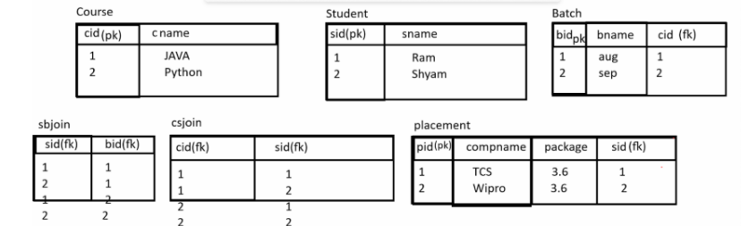

✅ Q. What is a Database?

A database is a collection of related data that is stored in an organized manner so that it can be easily accessed, managed, and updated.

It is a system that provides a standard way to store data permanently and maintain relationships between different data.

👉 In a relational system, a database is a collection of tables.
-------------------------------------------------
✅ Q. Why use Databases? / What are the benefits of Databases?

Databases are used to store, manage, and retrieve data efficiently. They provide several advantages as follows:

🔹 1. Permanent Data Storage
Data is stored permanently in the system.
It can be accessed anytime when required.

🔹 2. Organized Data Storage
Data is stored in structured formats such as tables (rows and columns).
It helps in maintaining relationships between different data.
Example: School database (Student, Teacher, Course tables)

🔹 3. Easy Data Retrieval
Data can be quickly searched and retrieved using queries.
Saves time and improves efficiency.

🔹 4. Data Security
Access control is provided to users.
Permissions can be set (read, write, update, delete).

🔹 5. Data Consistency
Ensures accurate and reliable data using constraints.
Avoids duplication and incorrect data.

🔹 6. Multi-User Facility
Multiple users can access the database at the same time.
Different access levels can be assigned to users.

🔹 7. Backup and Recovery
Database systems provide backup features.
Data can be restored in case of failure or loss.
---------------------------------------------------

✅ Q. How many ways to manage data? / Types of Database

There are different ways to manage data in a database system. The main types of databases are:

🔹 1. Relational Database (RDBMS)
Data is stored in the form of tables (rows and columns).
Row = Record
Column = Attribute
Example: MySQL, Oracle Database

🔹 2. Hierarchical Database
Data is stored in parent-child structure (tree format).
Similar to folder structure in operating systems.

🔹 3. Object-Oriented Database
Data is stored in the form of objects (like OOP concepts).
Example: MongoDB, Firebase

🔹 4. Cloud Database
Data is stored on remote servers and accessed via the internet.
No need to install locally.
Example: Google Docs

🔹 5. Distributed Database
Data is stored across multiple servers connected over a network.
Works as a single database system.

✅ Steps to Work with Relational Database
Install database software like MySQL or Oracle Database
https://dev.mysql.com/downloads/workbench/
Create a database
Create tables
Insert and manage data using SQL
---------------------------------------------------

✅ What is SQL?

SQL (Structured Query Language) is a language used to perform operations on relational databases such as:
    Creating tables
    Inserting data
    Updating data
    Retrieving data

✅ Q. How to create user-defined database in MySQL?

To create a user-defined database in MySQL, we use the following SQL commands:

🔹 1. Create Database
Syntax:
CREATE DATABASE databasename;

Example:
CREATE DATABASE aug2025;

🔹 2. Use Database
After creating the database, we need to select it:

Syntax:
USE databasename;

Example:
USE aug2025;

👉 Once selected, we can start working with tables and data.
-------------------------------------------------------------------
✅ Types of SQL Commands

🔸 1. DDL (Data Definition Language)
Used to define or modify table structure

Commands:
CREATE
DESC
ALTER
DROP
TRUNCATE

🔸 2. DML (Data Manipulation Language)
Used to manage data inside tables

Commands:
INSERT
UPDATE
DELETE

🔸 3. DQL (Data Query Language)
Used to retrieve data

Command:
SELECT

🔸 4. TCL (Transaction Control Language)
Used to manage transactions

Commands:
COMMIT
ROLLBACK
SAVEPOINT

🔸 5. DCL (Data Control Language)
Used to control user permissions

Commands:
GRANT
REVOKE

-------------------------------------------------------------------
✅ DDL Commands (Data Definition Language)

DDL commands are used to define and modify the structure of database objects such as tables, views, indexes, etc.

🔹 1. CREATE Command
Used to create database objects like:
create Table
create Procedure
create Function
create Index
create View
create Trigger
✅ Create Table

Syntax:

CREATE TABLE tablename(
  columnname datatype(size),
  columnname datatype(size)
);

Example:

CREATE TABLE employee(
  eid INT(5),
  name VARCHAR(200),
  salary INT(5)
);

🔹 2. DESCRIBE (DESC)
Used to view table structure

Syntax:
DESC tablename;

Example:
DESC employee;

🔹 3. ALTER Command
Used to modify table structure

    🔸 (a) ADD Column
    Single column:
    ALTER TABLE employee ADD COLUMN email VARCHAR(100);

    Multiple columns:
    ALTER TABLE employee ADD COLUMN (email VARCHAR(100), contact VARCHAR(15));

    🔸 (b) MODIFY Column
    Change datatype or size
    ALTER TABLE employee MODIFY COLUMN contact INT(10);

    🔸 (c) DROP Column
    Delete a column
    ALTER TABLE employee DROP COLUMN contact;

    🔸 (d) RENAME Column
    Change column name
    ALTER TABLE employee RENAME COLUMN contact TO phone;

🔹 4. TRUNCATE Command
    Deletes all records from table
    Structure remains same
    TRUNCATE TABLE employee;

🔹 5. DROP Command
    Deletes entire table (structure + data)
    DROP TABLE employee;

---------------------------------------------------------------------

✅ DML Commands (Data Manipulation Language)

DML commands are used to work with data inside tables (not structure) such as inserting, updating, and deleting records.

🔹 1. INSERT Command
Used to insert data into a table

🔸 (a) Full Insert (All Columns)
Values are provided for all columns

Syntax:
INSERT INTO tablename VALUES(value1, value2, ..., valueN);

Example:
INSERT INTO employee VALUES(1, 'Ram', 50000);

🔸 (b) Partial Insert (Specific Columns)
Values are inserted only into selected columns

Syntax:
INSERT INTO tablename(column1, column2) 
VALUES(value1, value2);

Example:
INSERT INTO employee(eid, name) VALUES(2, 'Shyam');

🔸 (c) Insert Multiple Records
INSERT INTO employee VALUES
(3, 'Amit', 40000),
(4, 'Neha', 45000);

🔹 2. DELETE Command
Used to delete records from a table
🔸 (a) Delete All Records
DELETE FROM employee;

🔸 (b) Delete Specific Records
DELETE FROM employee WHERE eid = 2;

🔹 3. UPDATE Command
Used to modify existing data
🔸 (a) Update All Records
UPDATE employee SET salary = 60000;

🔸 (b) Update Specific Record
UPDATE employee 
SET salary = 150000 
WHERE eid = 3;

------------------------------------------------------------------------
🔷 SQL Operators

✅ 1. Logical Operators
🔹 AND (&&)
Used when both conditions must be true

SELECT * FROM employee
WHERE id = 3 AND name = 'ganesh';

🔹 OR (||)
Used when any one condition is true

SELECT * FROM employee
WHERE id = 1 OR name = 'ganesh';

🔹 NOT
Used to exclude a condition
not , != , <>

SELECT * FROM employee
WHERE NOT name = 'ganesh';

✅ 2. IN Operator

👉 Used instead of multiple OR conditions

SELECT * FROM employee
WHERE salary IN (20000, 40000, 50000);

✔ Better than:
WHERE salary = 20000 OR salary = 40000 OR salary = 50000;

✅ 3. BETWEEN Operator
👉 Used for range (>= AND <=)

SELECT * FROM employee
WHERE salary BETWEEN 20000 AND 40000;

✔ Equivalent to:
WHERE salary >= 20000 AND salary <= 40000;

✅ 4 LIKE Operator (Pattern Matching)
Wildcards operator:
  % → multiple characters
  _ → single character

🔹 Starts with 'a'
  SELECT * FROM employee
  WHERE name LIKE 'a%';

🔹 Ends with 'sh'
  SELECT * FROM employee
  WHERE name LIKE '%sh';

🔹 Contains 'a'
SELECT * FROM employee
WHERE name LIKE '%a%';

🔹 Exactly 3 letters
SELECT * FROM employee
WHERE name LIKE '___';

🔹 Starts with 'm' and at least 3 letters
SELECT * FROM employee
WHERE name LIKE 'm__%';

----------------------------------------------------------------------

🔷 SQL Clauses
✅ 1. WHERE Clause
👉 Used to apply conditions

SELECT * FROM employee
WHERE salary > 20000;

✅ 2. GROUP BY Clause
👉 Groups similar values

SELECT salary
FROM employee
GROUP BY salary;

✔ Important:
Column must be in SELECT
Used with aggregate functions

🔷 type of Aggregate (Group) Functions
  perform operation on single column

🔹 COUNT()
  SELECT COUNT(salary) FROM employee;
  👉 Counts non-null values

  SELECT COUNT(*) FROM employee;
  👉 Counts all rows (including NULL)

  🔹 SUM()
  SELECT SUM(salary) FROM employee;

  🔹 AVG()
  SELECT AVG(salary) FROM employee;

  🔹 MAX()
  SELECT MAX(salary) FROM employee;

  🔹 MIN()
  SELECT MIN(salary) FROM employee;

✅ 3 HAVING Clause
👉 Used with GROUP BY (for aggregate conditions)

SELECT salary, COUNT(salary)
FROM employee
GROUP BY salary
HAVING COUNT(*) > 1;

✔ Used to find duplicate salaries

✅ 4  ORDER BY Clause
👉 Used to sort data

SELECT * FROM employee
ORDER BY salary DESC; //desending

✔ Default = ASC

🔷 Correct Order of SQL Clauses
SELECT column
FROM table
WHERE condition
GROUP BY column
HAVING condition
ORDER BY column;

👉 Sequence:
WHERE → GROUP BY → HAVING → ORDER BY

🔷 Combined Example (Important 🔥)

👉 Find:
Non-null salaries
Salary > 20000
Occurs at least once
Sort by count (DESC)

SELECT salary, COUNT(salary) 
FROM employee
WHERE  salary > 20000
GROUP BY salary
HAVING COUNT(salary) >= 1
ORDER BY count(salary) DESC;

------------------------------------------------------------------------

🔷 Constraints in SQL
✅ What are Constraints?

👉 Constraints are rules applied on table columns to control the type of data that can be stored.
✔ They help maintain:
  Data accuracy
  Data consistency
  Data integrity

🎯 Benefits of Constraints
  ❌ Prevent wrong/invalid data
  🚫 Avoid NULL values
  🔑 Ensure unique identity
  🔗 Create relationships between tables
  🎯 Set default values

✔ Validate data before inserting

🔷 Types of Constraints

✅ 1. NOT NULL Constraint
  👉 Column cannot store NULL value

  CREATE TABLE employee (
    name VARCHAR(100) NOT NULL
  );

  ✔ If user:
  Inserts NULL → ❌ Error
  Skips value → ❌ Error

✅ 2. UNIQUE Constraint
👉 Prevents duplicate values

CREATE TABLE employee (
  email VARCHAR(100) UNIQUE
);

✔ Used for:
Email
Phone number
Username

✔ Combination:
email VARCHAR(100) UNIQUE NOT NULL

✅ 3. PRIMARY KEY Constraint
👉 Combination of: UNIQUE + NOT NULL

CREATE TABLE employee (
  eid INT PRIMARY KEY,
  name VARCHAR(100) NOT NULL
);

✔ Rules:
Only one primary key per table
No duplicate values
No NULL values

🔥 Example
INSERT INTO employee VALUES (1, 'abc');
INSERT INTO employee VALUES (1, 'xyz'); -- ❌ ERROR

✅ 4. FOREIGN KEY Constraint
👉 Used to create relationship between tables

CREATE TABLE dept (
  deptid INT PRIMARY KEY
);

CREATE TABLE employee (
  eid INT PRIMARY KEY,
  deptid INT,
  FOREIGN KEY (deptid) REFERENCES dept(deptid)
);

✔ Key points:
Parent table → Primary Key
Child table → Foreign Key
Maintains referential integrity

🔷 Primary Key vs Unique Key

| Feature         | Primary Key | Unique Key               |
| --------------- | ----------- | ------------------------ |
| NULL allowed    | ❌ No       | ✅ Yes (one NULL allowed) |
| Duplicate       | ❌ No       | ❌ No                     |
| Count per table | Only 1      | Multiple allowed         |
| Index type      | Clustered   | Non-clustered            |

🔷 Important Notes
  A table must have one primary key (recommended)
  You can apply multiple constraints on one column
  Foreign key connects tables (Parent → Child)

✅ Q. How to create Foreign Key (Practically in MySQL)?

A foreign key is used to create a relationship between two tables.
It links a column in one table (child) to the primary key of another table (parent).

🔹 Syntax
CREATE TABLE tablename(
  columnname datatype(size),
  FOREIGN KEY(columnname) 
  REFERENCES parenttablename(primary_key_column)
);

🔹 Example (Practical)
✅ Create Parent Table

CREATE TABLE dept(
  deptid INT(5) PRIMARY KEY,
  deptname VARCHAR(200) NOT NULL UNIQUE
);

✅ Create Child Table with Foreign Key
CREATE TABLE employee(
  eid INT(5) PRIMARY KEY,
  ename VARCHAR(200) NOT NULL,
  email VARCHAR(200) NOT NULL UNIQUE,
  contact VARCHAR(200) NOT NULL UNIQUE,
  deptid INT(5),
  FOREIGN KEY(deptid) REFERENCES dept(deptid)
);

    ⚠️ Important Note (Very Important for Exam)
    If a parent record (primary key) is referenced in a child table:
    ❌ You cannot delete or update it directly

    delete from dept where deptid = 1;

    It will give an error

    👉 Example:
    If deptid = 1 exists in both dept and employee tables
    → You must delete child records first
    → Then delete parent record

    delete from employee where deptid = 1; (child)
    delete from dept where deptid = 1;  (parent)

    ❗ Problem in Real Systems
    In large databases, manually deleting child records is difficult.

    ✅ Solution: CASCADE Options

    🔸 1. ON DELETE CASCADE
    When parent record is deleted
    👉 All related child records are automatically deleted

    CREATE TABLE dept(
      deptid INT(5) PRIMARY KEY AUTO_INCREMENT,
      name VARCHAR(200) NOT NULL
    );

    CREATE TABLE employee(
      eid INT(5) PRIMARY KEY,
      name VARCHAR(200),
      email VARCHAR(200) UNIQUE,
    contact VARCHAR(15) UNIQUE
      deptid INT(5),
      FOREIGN KEY(deptid) 
      REFERENCES dept(deptid)
      ON DELETE CASCADE
    );

    📌 Example:
    Step 1: Insert into dept
    INSERT INTO dept(name) VALUES('IT'), ('HR');

    Step 2: Insert into employee
    INSERT INTO employee VALUES
    (1, 'Ram', 'ram@gmail.com', '9999999999', 1),
    (2, 'Shyam', 'shyam@gmail.com', '8888888888', 1);

    ❗ Now delete parent record:
    DELETE FROM dept WHERE deptid = 1;

    🔸 2. ON UPDATE CASCADE
    👉 When a primary key value (parent table) is updated,
    👉 The foreign key values (child table) are automatically updated.

    🔹 Syntax
    CREATE TABLE tablename(
      columnname datatype(size),
      FOREIGN KEY(columnname) 
      REFERENCES parenttablename(columnname)
      ON UPDATE CASCADE
    );
    🔹 Example
    CREATE TABLE dept(
      deptid INT(5) PRIMARY KEY AUTO_INCREMENT,
      name VARCHAR(200) NOT NULL
    );

    CREATE TABLE employee(
      eid INT PRIMARY KEY,
      deptid INT,
      FOREIGN KEY(deptid)
      REFERENCES dept(deptid)
      ON UPDATE CASCADE
      ON DELETE CASCADE
    );

    📌 Example:
    Step 1: Insert into dept
    INSERT INTO dept(name) VALUES('IT'), ('HR');

    Step 2: Insert into employee
    INSERT INTO employee VALUES
    (1, 'Ram', 'ram@gmail.com', '9999999999', 1),
    (2, 'Shyam', 'shyam@gmail.com', '8888888888', 1);

    ❗ Now update parent record:
    update dept set deptid = 1 where name = 'prod';

    🔹 Using Both CASCADE Options Together
    👉 You can use ON UPDATE CASCADE and ON DELETE CASCADE together:

    🔸 3. ON DELETE SET NULL
    When parent record is deleted
    👉 Foreign key in child table becomes NULL

    CREATE TABLE dept(
      deptid INT(5) PRIMARY KEY AUTO_INCREMENT,
      name VARCHAR(200) NOT NULL
    );

    CREATE TABLE employee(
      eid INT(5) PRIMARY KEY,
      name VARCHAR(200),
      email VARCHAR(200),
      contact VARCHAR(200),
      deptid INT(5),
      FOREIGN KEY(deptid) 
      REFERENCES dept(deptid)
      ON DELETE SET NULL
    );

    📌 Example:
    Step 1: Insert into dept
    INSERT INTO dept(name) VALUES('IT'), ('HR');

    Step 2: Insert into employee
    INSERT INTO employee VALUES
    (1, 'Ram', 'ram@gmail.com', '9999999999', 1),
    (2, 'Shyam', 'shyam@gmail.com', '8888888888', 1);

    ❗ Now delete parent record:
    delete from dept where deptid = 1;

✅ 4. CHECK Constraint
✅ Definition

CHECK constraint is used to apply a condition on a column at the time of table creation.
👉 If the condition is true, data is inserted
👉 If false, it gives an error

🔹 Syntax
CREATE TABLE tablename(
  columnname datatype(size) CHECK(condition)
);

🔹 Example
CREATE TABLE employee(
  eid INT(5) PRIMARY KEY,
  name VARCHAR(200),
  age INT(5) CHECK(age > 18)
);
⚠️ Important
If age = 10 → ❌ Error (condition fails)
Error like: constraint violated

✅ 5. DEFAULT Constraint
✅ Definition

DEFAULT constraint assigns a default value to a column
👉 If user does not provide value → default value is used

🔹 Syntax
CREATE TABLE tablename(
  columnname datatype(size) DEFAULT value
);
🔹 Example
CREATE TABLE employee(
  eid INT(5) PRIMARY KEY,
  name VARCHAR(200),
  desig VARCHAR(200) DEFAULT 'SE'
);
🔹 Insert Example
INSERT INTO employee (eid, name) VALUES(1, 'RAM');
👉 Output: desig = 'SE' (default applied)

INSERT INTO employee (eid, name, desig) VALUES(2, 'SHYAM', 'SD');
👉 Output: desig = 'SD' (user value overrides default)

🔹 3. AUTO_INCREMENT
✅ Definition

AUTO_INCREMENT automatically generates unique values (usually for primary key).

🔹 Syntax
CREATE TABLE employee(
  eid INT(5) PRIMARY KEY AUTO_INCREMENT,
  name VARCHAR(200),
  desig VARCHAR(200) DEFAULT 'SE'
);
🔹 Insert Example
INSERT INTO employee (eid, name) VALUES(NULL, 'RAM');

👉 eid will be generated automatically (1, ram, se)

------------------------------------------------------------------------
✅ Joins in SQL
🔹 Q. What is Join?

A JOIN is used to fetch data from two or more tables that are related using a common column (usually Primary Key & Foreign Key).

SELECT ltr.column_name, rtr.column_name
FROM left_table ltr
JOIN_TYPE right_table rtr
ON ltr.common_column = rtr.common_column;

✅ Types of Joins
🔸 1. INNER JOIN
Returns only matching (common) records from both tables

SELECT d.deptname, e.name, e.email, e.contact
FROM dept d 
INNER JOIN employee e 
ON d.deptid = e.deptid;

👉 Only records where deptid matches in both tables

🔸 2. LEFT JOIN
Returns all records from left table + matching from right

SELECT d.deptname, e.name , e.email, e.contact
FROM dept d 
LEFT JOIN employee e 
ON d.deptid = e.deptid;

👉 Non-matching right values → NULL

🔸 3. RIGHT JOIN
Returns all records from right table + matching from left

SELECT d.deptname, e.name, e.mail, e.contact 
FROM dept d 
RIGHT JOIN employee e 
ON d.deptid = e.deptid;

👉 Non-matching left values → NULL

🔸 4. FULL OUTER JOIN
Returns all records from both tables
👉 In MySQL, FULL JOIN is not direct → use UNION

SELECT d.deptname, e.name 
FROM dept d 
LEFT JOIN employee e ON d.deptid = e.deptid
UNION
SELECT d.deptname, e.name 
FROM dept d 
RIGHT JOIN employee e ON d.deptid = e.deptid;

🔸 5. SELF JOIN
Join a table with itself

SELECT a.name, b.name 
FROM employee a, employee b 
WHERE a.manager_id = b.eid;

or

SELECT a.name AS Employee, b.name AS Manager
FROM employee a
INNER JOIN employee b
ON a.manager_id = b.eid;

🔸 6. CROSS JOIN (Cartesian Product)
Returns all combinations (m × n)

SELECT d.deptname, e.name 
FROM employee e 
CROSS JOIN dept d;

------------------------------------------------------------------------
✅ Important SQL Queries (Exam Based)

🔹 1. Dept without Employees

SELECT d.deptname, COUNT(e.deptid)
FROM dept d 
LEFT JOIN employee e ON d.deptid = e.deptid
GROUP BY d.deptname
HAVING COUNT(e.deptid) = 0;

🔹 2. Employees without Department
SELECT e.name, COUNT(e.deptid)
FROM dept d 
RIGHT JOIN employee e ON d.deptid = e.deptid
GROUP BY e.eid
HAVING COUNT(e.deptid) = 0;
🔹 3. Dept without Employees (Name starts with H)
SELECT d.deptname, COUNT(e.deptid)
FROM dept d 
LEFT JOIN employee e ON d.deptid = e.deptid
WHERE d.deptname LIKE 'H%'
GROUP BY d.deptname
HAVING COUNT(e.deptid) = 0;

--------------------------------------------------------------
✅ Joins with Multiple Tables

mysql> create table course(cid int(5) primary key auto_increment,cname varchar(200));
Query OK, 0 rows affected, 1 warning (0.21 sec)

mysql> create table student(sid int(5) primary key auto_increment,sname varchar(200));
Query OK, 0 rows affected, 1 warning (0.03 sec)

mysql> create table batch(bid int(5) primary key auto_increment,bname varchar(200),cid int(5),foreign key(cid) references course(cid));
Query OK, 0 rows affected, 2 warnings (0.08 sec)

mysql> create table sbjoin(sid int(5),foreign key(sid) references student(sid),bid int(5),foreign key(bid) references batch(bid));
Query OK, 0 rows affected, 2 warnings (0.07 sec)

mysql> create table csjoin(cid int(5),foreign key(cid) references course(cid),sid int(5),foreign key(sid) references student(sid));
Query OK, 0 rows affected, 2 warnings (0.07 sec)

mysql> create table placement(pid int(5) primary key auto_increment,compname varchar(200),package int(5),sid int(5),foreign key(sid) references student(sid));
Query OK, 0 rows affected, 3 warnings (0.07 sec)

🔹 Example: Course-wise Student List
SELECT c.cname, s.sname
FROM course c
INNER JOIN csjoin cs ON c.cid = cs.cid
INNER JOIN student s ON cs.sid = s.sid;

🔹 Course-wise Admission Count
SELECT c.cname, COUNT(cs.sid) AS total_students
FROM course c
INNER JOIN csjoin cs ON c.cid = cs.cid
GROUP BY c.cname;

🔹 3. Placement Details (Course + Student + Company + Package)
SELECT c.cname, s.sname, p.compname, p.package

FROM course c
INNER JOIN csjoin cs ON c.cid = cs.cid
INNER JOIN student s ON s.sid = cs.sid
INNER JOIN placement p ON p.sid = s.sid;

🔹 Placement with Batch Name
SELECT c.cname, s.sname, p.compname, p.package, b.bname
FROM course c
INNER JOIN csjoin cs ON c.cid = cs.cid
INNER JOIN student s ON s.sid = cs.sid
INNER JOIN placement p ON p.sid = s.sid
INNER JOIN sbjoin sb ON sb.sid = s.sid
INNER JOIN batch b ON b.bid = sb.bid;

🔹 Course-wise Placement Count
SELECT c.cname, COUNT(p.sid) AS placed_students
FROM course c
INNER JOIN csjoin cs ON c.cid = cs.cid
INNER JOIN placement p ON p.sid = cs.sid
GROUP BY c.cid;

--------------------------------------------------------------------

🔷 What is Normalization?

👉 Normalization = Breaking a large table into smaller tables
to:

❌ Avoid data duplication
❌ Remove anomalies
✔ Improve data integrity

🔷 Important Concepts Before Normalization
  Association 
  Dependency 
  Keys concepts 
  Normalization 
-----------------------------------------------------------
✅ 1. Association (Relationship)
👉 Defines relationship between tables

🔹 One-to-Many
One record → many records

✔ Example: One course → many students
 
🔹 many to one 
  means reverse direction of one to many 
 
🔹 Many-to-Many
Many ↔ many
✔ Example: Students ↔ Courses

👉 Requires intermediate table (junction table)

CREATE TABLE student_course (
  sid INT,
  cid INT,3
  FOREIGN KEY (sid) REFERENCES student(sid),
  FOREIGN KEY (cid) REFERENCES course(cid)
);

🔹 One-to-One
One ↔ one

✔ Example: User → Profile

CREATE TABLE profile (
  pid INT PRIMARY KEY,
  userid INT UNIQUE,
  FOREIGN KEY (userid) REFERENCES users(userid)
);
------------------------------------------------------------
🔷 2. Dependency in DBMS

👉 Dependency = How one column depends on another

🔹 Functional Dependency
👉 One column identifies another
📌 Format: X → Y

✔ Example:
have userid as primary key using that column we can uniquely identify user details
userid → username

🔹 Full Functional Dependency
👉 Depends on entire composite key
when we create more than one column as primary key called as composite primary key ,when we create more than one column as foreign key called as composite foreign key etc 

✔ Example:
(sid, subid) → score

🔹 Partial Dependency
👉 When a non-key attribute depends on part of a composite key, not the whole key.

✔ Example:
(sid, subid) → teachername
subid → teachername
❌ Problem → leads to redundancy

🔹 Transitive Dependency
👉When one attribute depends on another through a third attribute.

✔ Example:
sid → examid → totalmarks
sid → totalmarks

❌ Problem → violates 3NF

Composite key : Composite key if we combine more than one column to identify a record called a composite key.

   Types of composite keys 
Composite key primary key : when we create two or more  than two column as primary key called as composite primary 
If we create composite primary key then record uniquely identify using combination of both column 

How to create composite primary key practically 
_________________________________________________________
Syntax:
Create table tablename(columnname datatype(size),columnname datatype(size),.... Columnname datatype(size),primary key(columnname,columnname));

Example with source code
___________________________________________________________________
mysql> create table teacher(tid int(5),tname varchar(200),temail varchar(200),tcontact varchar(200),tsub varchar(200),primary key(tid,tname,tsub));
Query OK, 0 rows affected, 1 warning (0.04 sec)

Note: if we think about composite primary if all columns contain the same value which is mentioned in the primary key then consider a record considered as a duplicated record if  any one column has a different value  then consider a unique record.

Composite unique key : composite unique key means when we use more than one column as unique key  then called as composite unique key 

mysql> create table student(sid int(5) primary key,sname varchar(200),semail varchar(200),scontact varchar(200),unique(semail,scontact));
Query OK, 0 rows affected, 1 warning (0.06 sec)

Composite foreign key : when we use more than column as foreign key for uniquely identify called as composite primary key 

mysql> create table course(cid int(5) primary key ,cname varchar(200) not null unique,fees int(5));
Query OK, 0 rows affected, 2 warnings (0.05 sec)

mysql> create table student(sid int(5) primary key ,sname varchar(200));
Query OK, 0 rows affected, 1 warning (0.04 sec)

mysql> create table csjoin(cid int(5),foreign key(cid) references course(cid),sid int(5),foreign key(sid) references student(sid),unique(cid,sid));
Query OK, 0 rows affected, 2 warnings (0.10 sec)

Your notes are mostly correct 👍 — let me refine and organize them so they are clear, correct, and exam-ready.

🔑 Composite Key in DBMS
✅ Definition
A Composite Key is a key formed by combining two or more columns to uniquely identify a record in a table.

👉 Used when a single column is not enough to uniquely identify records.

📌 Types of Composite Keys
1️⃣ Composite Primary Key
✅ Definition
When two or more columns together act as a primary key, it is called a Composite Primary Key.

🔹 Important Points
Combination must be unique

Individual columns may have duplicate values

Together → must be unique

🧾 Syntax
CREATE TABLE tablename(
  column1 datatype,
  column2 datatype,
  column3 datatype,
  PRIMARY KEY(column1, column2)
);
💻 Example
CREATE TABLE teacher(
  tid INT(5),
  tname VARCHAR(200),
  temail VARCHAR(200),
  tcontact VARCHAR(200),
  tsub VARCHAR(200),
  PRIMARY KEY(tid, tname, tsub)
);
🧠 Explanation
A record is duplicate only if ALL key columns match

If any one column is different, the record is unique ✔️

2️⃣ Composite Unique Key
✅ Definition
When multiple columns together are declared UNIQUE, it is called a Composite Unique Key.

🔹 Points
Prevents duplicate combinations

Individual columns can repeat

💻 Example
CREATE TABLE student(
  sid INT(5) PRIMARY KEY,
  sname VARCHAR(200),
  semail VARCHAR(200),
  scontact VARCHAR(200),
  UNIQUE(semail, scontact)
);
🧠 Meaning
Same email + same contact ❌ not allowed

Same email + different contact ✔️ allowed

3️⃣ Composite Foreign Key ⚠️ (Correction)
👉 Your definition needs a small correction:

❌ You wrote:
used more than column as foreign key for uniquely identify called as composite primary key

✅ Correct Definition:
A Composite Foreign Key is when multiple columns together reference a composite primary key in another table.

💻 Correct Example
Parent Table
CREATE TABLE course_student(
  cid INT,
  sid INT,
  PRIMARY KEY(cid, sid)
);
Child Table (Composite Foreign Key)
CREATE TABLE marks(
  cid INT,
  sid INT,
  marks INT,
  FOREIGN KEY(cid, sid) REFERENCES course_student(cid, sid)
);
⚠️ Important Concept
👉 In your example:

CREATE TABLE csjoin(
  cid INT(5),
  FOREIGN KEY(cid) REFERENCES course(cid),
  sid INT(5),
  FOREIGN KEY(sid) REFERENCES student(sid),
  UNIQUE(cid,sid)
);
🔍 This is NOT a composite foreign key
✔ It is:

Two separate foreign keys

Composite UNIQUE key

🎯 Final Summary
Type	Description
Composite Key	Combination of columns
Composite Primary Key	Multiple columns as PRIMARY KEY
Composite Unique Key	Multiple columns as UNIQUE
Composite Foreign Key	Multiple columns referencing another composite key
If you want, I can draw a diagram or show table data examples to make it even easier to understand 👍

super key

🔑 Super Key in DBMS
✅ Definition
A Super Key is a set of one or more columns that can uniquely identify a record in a table.

👉 It may contain extra (unnecessary) attributes, but still uniquely identifies each row.

📌 Example Table: Student
sid	name	email	contact
1	Rahul	rahul@gmail.com	987654321
2	Amit	amit@gmail.com	912345678
🔍 Possible Super Keys
{sid} ✅

{email} ✅

{sid, name} ✅

{sid, email, contact} ✅

👉 All above are Super Keys because they uniquely identify records.

⚠️ Important Point
👉 A Super Key can have extra columns

Example:

{sid} → enough ✔️

{sid, name} → still unique but extra column added ✔️

🔁 Relation with Other Keys
Key Type	Description
Super Key	Unique (may have extra columns)
Candidate Key	Minimal super key (no extra column)
Primary Key	Selected candidate key
🧠 Simple Understanding
👉 Think like this:

Super Key = Any combination that gives uniqueness

Candidate Key = Smallest such combination

Primary Key = Chosen one

🎯 Example for Clarity
If:

sid is unique

email is unique

Then:

Super Keys → {sid}, {email}, {sid, email}, {sid, name}

Candidate Keys → {sid}, {email}

Primary Key → choose one (e.g., {sid})

If you want, I can give practice questions or a diagram to make it even clearer 👍

| sid | name  | email                                     | contact   |
| --- | ----- | ----------------------------------------- | --------- |
| 1   | Rahul | [rahul@gmail.com](mailto:rahul@gmail.com) | 987654321 |
| 2   | Amit  | [amit@gmail.com](mailto:amit@gmail.com)   | 912345678 |

Great 👍 You shared a table — let’s understand Super Key using this data clearly.

📊 Given Table: Student
sid	name	email	contact
1	Rahul	rahul@gmail.com	987654321
2	Amit	amit@gmail.com	912345678
🔑 Step 1: Identify Unique Columns
👉 Check which columns uniquely identify each record:

sid → Unique ✔️

email → Unique ✔️

contact → Unique ✔️ (assuming no duplicates)

name → Not unique ❌ (can repeat)

🔍 Step 2: Find Super Keys
A Super Key = any combination of columns that uniquely identifies records.

✅ Possible Super Keys:
{sid}

{email}

{contact}

{sid, name}

{sid, email}

{email, contact}

{sid, name, email}

{sid, email, contact}

👉 All these are Super Keys because they ensure uniqueness.

❌ Not Super Keys
{name} → ❌ (duplicate possible)

{name, contact} → ❌ (if contact repeats in future)

🎯 Step 3: Candidate Keys
👉 Candidate Key = minimal super key (no extra column)

✅ Candidate Keys:
{sid}

{email}

{contact}

🏆 Step 4: Primary Key
👉 From candidate keys, we choose one:

✔ Usually:

PRIMARY KEY (sid)
🧠 Final Understanding
Super Key → May contain extra columns

Candidate Key → Minimum columns

Primary Key → Selected candidate key

If you want, I can convert this into SQL table + insert + query examples for practice 👍

| sid | name  | email                                     | contact   |
| --- | ----- | ----------------------------------------- | --------- |
| 1   | Rahul | [rahul@gmail.com](mailto:rahul@gmail.com) | 987654321 |
| 2   | Amit  | [amit@gmail.com](mailto:amit@gmail.com)   | 912345678 |

Nice 👍 Let’s analyze this table again step-by-step to make your Super Key concept crystal clear.

📊 Student Table
sid	name	email	contact
1	Rahul	rahul@gmail.com	987654321
2	Amit	amit@gmail.com	912345678
🔑 Step 1: Check Uniqueness
Column	Unique or Not
sid	✅ Unique
email	✅ Unique
contact	✅ Unique
name	❌ Not unique (can repeat)
🔍 Step 2: Super Keys
👉 A Super Key is any combination of columns that uniquely identifies records.

✅ All Super Keys:
{sid}

{email}

{contact}

{sid, name}

{sid, email}

{sid, contact}

{email, contact}

{sid, name, email}

{sid, email, contact}

{sid, name, contact}

{sid, name, email, contact}

✔ All above combinations uniquely identify rows → so they are Super Keys

❌ Not Super Keys
{name} ❌

{name, sid}? → actually this becomes ✔️ (because sid is unique)

👉 Rule:

If combination contains at least one unique column, it becomes a Super Key

🎯 Step 3: Candidate Keys
👉 Minimal super keys (no extra column)

✅ Candidate Keys:
{sid}

{email}

{contact}

🏆 Step 4: Primary Key
👉 We usually choose:

PRIMARY KEY (sid)
🧠 Final Trick (Very Important for Exams)
👉 Shortcut to find Super Keys:

Find unique columns

Any combination including that column = Super Key

If you want, I can give you tricky exam questions or MCQs on super key 👍

Normalizations 
__________________________________________________________________
Normalization means decomposing a large database table  into a smaller database table to avoid data duplication and some anomalies and provide a relationship between them called normalization.

Q. Why use normalization or What are the benefits of normalizations?
_____________________________________________________________________
Avoid data redundancy:  if we not perform normalisation there is possibility table may contain data duplication or redundancy 

If we think about above admission table we have column aid,name,email,contact ,course,fees,duration,qualification 
Here course, fees, duration and qualification table may contain duplicated records so it may create unnecessary data in table.
So if we want to avoid this problem we can decompose this large table into smaller tables  like as 

If we think about table we divide single large table into smaller two tables like as for course we have one table and for admission we have one table and we pass course  i.e cid in admission table as foreign for identify course so the benefit is 
Single column in admission table cid is responsible for give complete info of student course but cid is primary key in course table which responsible give complete info of course in course table 

Avoid insertion/deletion/updation anomalies 
_________________________________________________________________
Insertion anomalies : 

If we think about above database table i.e admission we have one student name as ganesh he confused about choosing department  like as CSE or ETC 
So in this scenario we have two possibilities 
Not insert ganesh personal info in admission table 
Insert personal info of ganesh and mark remaining column as null in table 

Deletion anomalies : 
Example of deletion anomalies 

Suppose consider we have table name as admission with above mention column and we want to delete record of MR.X and we write query like as 

	Example: delete from admission where dept hod=’MR.X’
And suppose consider we have 500 students in CSE dept under MR.X all record get deleted means the meaning is HOD leave the dept all student also leave the dept but it is not real time scenario 
Means hod deletion has an impact on student record.
If we want to avoid this problem we can divide the table in multiple tables like as
Separate admission  table, separate dept table etc 

If we think about above database we want to delete  record of HOD then we use hod table and can execute the query like as delete from hod where hodid=1;
So only HOD record get deleted and it is not affect on dept as well as student record means not student record delete as well as deptdelete so this is the benefit we can decompose large table into smaller table and it is benefit of normalization 
Updation anomalies : 
Example:

Suppose consider we want to change CSE dept contact and suppose CSE has 500 admission and we write query like as update admission set deptcontact=33333  where detpname=CSE so 500 record internally updated by database engine it may be impact query performance if we have large database like as 1cr record etc
Suppose if we divide the admission table into subtables 

Means seperate the dept table and we want to update department contact so we execute update command on dept table like  as update dept set contact=333333 where deptid=1; here only one record get updated 

Improve data integrity : Data integrity refers to the accuracy , consistency and reliability of data through the life cycle 

If we want to work with normalization we have some types of normalization 
1NF : 
Rules of 1NF
Table must have unique column name
column must have atomic values 
Column must have same domain data 

Table without normalization 
_____________________________________________________________

If we think about above table it is not in 1NF because this table not follow the 2nd rule of normal form 
Because if we think about course column it contain more than one values like C,C++  
Means we store more than one by separating column and it is very difficult to manage real time database like as if we think about fees of course and if every course having different fees then ,different duration so it is very difficult to manage 

So above table can manage in first normal form like as 

If we think about above  table it is in first normal form 
Because this table follow all rules of 1NF 
If we think about above table it generate the data duplication 
So you can give this table data in different table and manage the using primary and foreign key relationship means according to above table there is many to many relation because single student can enroll to multiple subject and single subject can have multiple students 
If we want to handle the many to many relationship we have to create one intermediate table 
Which contain only  foreign keys shown in following table structure

2NF : 
Rules of 2NF
Table must be first normal form
Table should not contain partial dependency 

If we think about above score table it is not in second normal form because score table contain partial dependency 

How we can say score table contain partial dependency 

In score table we have following attributes 
scrid -it is primary key 
(sid,subid) - both are composite key 
Score and teachername are the non primary key attributes 

Suppose consider we want  to uniquely identify score the we must know the sid and subid means non primary attribute score is 100% dependent on composite key so score column not generate the partial dependency 

Example: if we think about 70 marks obtain then we need to know student name and course name but in score table we can identify student name using sid and course name using cid means we need to both  for identify 70 marks so here no partial dependency 

Suppose consider we want to identify teacher uniquely so non primary key attribute teachername but teachername can identify using coursename and course name represent by  cid  in score table  there no necessary to identify teacher using student 
Means for teacher identification we not need to know the sid and in score table (sid,cid) are the composite key means here teachername column is partially dependent composite key i.e half portion of composite key i.e on cid so this is major reason score table not in 2nd normal form 

If we want to arrange score table in second normal form we can remove teachername column from score table and use in another table table according to relationship between teacher and course 

 There is possibility of three relationship in course and teacher 
  _________________________________________________________________
One to one  - single course has only one teacher 

One to many : single course has multiple teacher 

Many to many : there is possibility single course has multiple teacher and single teacher can teach more than courses 

3NF : 
Rules of 3NF
Table must be second normal form
Table should not contain transitive dependency 
Note: non primary key attribute is dependent on another non primary key attribute called as transitive dependency 

If we think about score table in above diagram can it is not in third normal format because  score table contain transitive dependency 
If  we think about score column or identify score of student then we need to know 
Sid,subid - but these are primary key attribute (foreign key is indirectly primary key/uique)
So here score column not maintain the transitive dependency but we need know to examine and total marks of that exam for identify score of student so here exam name and total marks are the non primary key attribute and score also non primary key attribute so here we have transitive dependency in score table because transitive dependency means when one non primary key attribute is dependent on another primary key attribute 
So if we want to arrange score table in 3rd NF we have to separate exam name and totalmarks in another table and provide relationship between score and exam table 

3.5NF or boyce code 
4NF
5NF

Your notes are very good and detailed 👍, but I’ll refine them into a clean, exam-ready version with correct wording and structure.

📚 Normalization in DBMS
✅ Definition
Normalization is the process of decomposing a large table into smaller tables to:

Remove data redundancy (duplication)

Avoid anomalies

Maintain proper relationships using keys

🎯 Why Do We Use Normalization?
1️⃣ Avoid Data Redundancy
Duplicate data increases storage and causes inconsistency

Example: Course details repeated for every student

👉 Solution:
Split into:

Student table

Course table

2️⃣ Avoid Anomalies
🔸 Insertion Anomaly
👉 Problem:

Cannot insert student without course info

OR must insert NULL values

👉 Example:

Student Ganesh not decided course → cannot store properly

🔸 Deletion Anomaly
👉 Problem:

Deleting one record removes other important data

👉 Example:

DELETE FROM admission WHERE hod = 'MR.X';
❌ Deletes all students under that HOD

👉 Solution:

Separate tables:

Student

Department

HOD

🔸 Update Anomaly
👉 Problem:

Same data updated multiple times

👉 Example:

UPDATE admission 
SET deptcontact = 33333 
WHERE deptname = 'CSE';
❌ Updates hundreds of rows → slow & error-prone

👉 Solution:

Store department info in separate table

Update only one record ✔️

3️⃣ Improve Data Integrity
👉 Ensures:

Accuracy

Consistency

Reliability of data

📊 Normal Forms
🥇 1NF (First Normal Form)
✅ Rules:
Table must have unique column names

Values must be atomic (single value)

Column must contain same type of data

❌ Not in 1NF
sid	name	course
1	A	C, C++
👉 Multiple values in one column ❌

✅ In 1NF
sid	name	course
1	A	C
1	A	C++
✔ Atomic values

⚠️ Issue
Causes data duplication

👉 Solution:

Create separate tables + relationships

🥈 2NF (Second Normal Form)
✅ Rules:
Must be in 1NF

No Partial Dependency

🔍 What is Partial Dependency?
👉 When a non-key column depends on part of a composite key

❌ Example (Not in 2NF)
sid	cid	marks	teacher
Primary Key → (sid, cid)

teacher depends only on cid ❌

👉 This is partial dependency

✅ Solution
Split into:

Score Table
| sid | cid | marks |

Course-Teacher Table
| cid | teacher |

✔ Now no partial dependency

🥉 3NF (Third Normal Form)
✅ Rules:
Must be in 2NF

No Transitive Dependency

🔍 What is Transitive Dependency?
👉 When:

Non-key column depends on another non-key column

❌ Example
| sid | cid | marks | exam | total_marks |

marks depends on exam

exam → total_marks

👉 Non-key → Non-key dependency ❌

✅ Solution
Split into:

Score Table
| sid | cid | marks | exam_id |

Exam Table
| exam_id | exam | total_marks |

✔ Removes transitive dependency

🧠 Final Summary
Normal Form	Removes
1NF	Multi-valued attributes
2NF	Partial dependency
3NF	Transitive dependency
⚡ Key Concept Shortcut
1NF → Atomic values

2NF → Full dependency

3NF → No indirect dependency

🚀 Extra (Advanced Forms)
BCNF (Boyce-Codd Normal Form) → Stronger than 3NF

4NF → Removes multi-valued dependency

5NF → Removes join dependency

If you want, I can:
✅ Create exam questions (MCQs + theory)
✅ Show real SQL table design step-by-step
✅ Give easy tricks to remember all normal forms 👍

dpendancy

🔗 Dependency in DBMS
✅ Definition
A Dependency in DBMS means that the value of one attribute (column) depends on another attribute.

👉 It describes a relationship between columns in a table.

📌 Types of Dependency
1️⃣ Functional Dependency (FD)
✅ Definition
A Functional Dependency occurs when one attribute uniquely determines another.

👉 Written as:

A → B
Means:

If we know A, we can find B

📊 Example
sid	name	email
1	Rahul	rahul@gmail.com
2	Amit	amit@gmail.com
👉 Functional Dependencies:

sid → name

sid → email

✔ Because sid uniquely identifies all other columns

🔍 Types of Functional Dependency
2️⃣ Full Dependency
✅ Definition
When a column depends on the entire primary key (all columns).

📊 Example
sid	cid	marks
👉 Primary Key = (sid, cid)

(sid, cid) → marks ✔

✔ marks depends on both sid and cid → Full Dependency

3️⃣ Partial Dependency
❌ Definition
When a column depends on only part of a composite key

📊 Example
sid	cid	teacher
👉 Primary Key = (sid, cid)

cid → teacher ✔

teacher does NOT depend on sid ❌

👉 So this is Partial Dependency

4️⃣ Transitive Dependency
❌ Definition
When a non-key attribute depends on another non-key attribute

📊 Example
sid	dept_id	dept_name
sid → dept_id

dept_id → dept_name

👉 So:

sid → dept_name (indirect)

❌ This is Transitive Dependency

🎯 Summary Table
Type	Meaning
Functional Dependency	A → B
Full Dependency	Depends on whole key
Partial Dependency	Depends on part of key
Transitive Dependency	Non-key → Non-key
🧠 Easy Trick
FD → One determines another

Full → Whole key

Partial → Half key

Transitive → Indirect dependency

If you want, I can give:
✅ Practice questions
✅ MCQs for exams
✅ SQL-based examples

Just tell me 👍

5 Multivalued dependency 

🔗 Multivalued Dependency (MVD) in DBMS
✅ Definition
A Multivalued Dependency occurs when:

👉 One attribute determines multiple independent values of another attribute.

👉 Written as:
A →→ B
Means:
For a single value of A, there can be multiple values of B
And those values are independent of other attributes

📊 Example
Student Table
| sid | hobby   | course |
| --- | ------- | ------ |
| 1   | Cricket | Java   |
| 1   | Cricket | Python |
| 1   | Music   | Java   |
| 1   | Music   | Python |

🔍 Understanding
👉 Here:
A student can have multiple hobbies
A student can enroll in multiple courses

But:
Hobby and Course are independent

✅ Multivalued Dependencies
sid →→ hobby
sid →→ course
✔ Both are independent of each other

❌ Problem (Redundancy)
👉 Data is repeated unnecessarily:

Cricket repeated with multiple courses
Music repeated with multiple courses

👉 This creates data redundancy

------------------------------------------------------------

🔷 3. Key Concepts

  Primary key 
  Unique key 
  Foreign key 
  Composite key 
  Candidate key 
  Super key 
  Surrogate key  

🔹 Primary Key 
Unique + Not Null 
Only one per table  

🔹 Candidate Key 
All possible unique keys  
Only one candidate key become primary key  

Suppose consider we have student table with column sid (primary key),name,emai (unique),contact (unique), age ;
✔ Example:
sid  
email  
contact  

🔹 Super Key
A Super Key is a set of one or more columns that can uniquely identify a record in a table.

👉 It may contain extra (unnecessary) attributes, but still uniquely identifies each row.

📌 Example Table: Student
| sid | name  | email                                     | contact   |
| --- | ----- | ----------------------------------------- | --------- |
| 1   | Rahul | [rahul@gmail.com](mailto:rahul@gmail.com) | 987654321 |
| 2   | Amit  | [amit@gmail.com](mailto:amit@gmail.com)   | 912345678 |

🔍 Possible Super Keys
{sid} ✅
{email} ✅
{sid, name} ✅
{sid, email, contact} ✅
👉 All above are Super Keys because they uniquely identify records.

⚠️ Important Point
👉 A Super Key can have extra columns

Example:
{sid} → enough ✔️
{sid, name} → still unique but extra column added ✔️

🔹 Composite Key
A Composite Key is a key formed by combining two or more columns to uniquely identify a record in a table.

👉 Used when a single column is not enough to uniquely identify records.

📌 Types of Composite Keys

1️⃣ Composite Primary Key
✅ Definition

When two or more columns together act as a primary key, it is called a Composite Primary Key.

🧾 Syntax
CREATE TABLE tablename(
  column1 datatype,
  column2 datatype,
  column3 datatype,
  PRIMARY KEY(column1, column2)
);
💻 Example
CREATE TABLE teacher(
  tid INT(5),
  tname VARCHAR(200),
  temail VARCHAR(200),
  tcontact VARCHAR(200),
  tsub VARCHAR(200),
  PRIMARY KEY(tid, tname, tsub)
);
🧠 Explanation
A record is duplicate only if ALL key columns match not allowed
If any one column is different, the record is unique ✔️

2️⃣ Composite Unique Key
✅ Definition

When multiple columns together are declared UNIQUE, it is called a Composite Unique Key.

🔹 Points
Prevents duplicate combinations
Individual columns can repeat

💻 Example
CREATE TABLE student(
  sid INT(5) PRIMARY KEY,
  sname VARCHAR(200),
  semail VARCHAR(200),
  scontact VARCHAR(200),
  UNIQUE(semail, scontact)
);
🧠 Meaning
Same email + same contact ❌ not allowed
Same email + different contact ✔️ allowed

3️⃣ Composite Foreign Key ⚠️ (Correction)

👉 Your definition needs a small correction:

A Composite Foreign Key is when multiple columns together reference a composite primary key in another table.

💻 Correct Example
Parent Table
CREATE TABLE course_student(
  cid INT,
  sid INT,
  PRIMARY KEY(cid, sid)
);

Child Table (Composite Foreign Key)
CREATE TABLE marks(
  cid INT,
  sid INT,
  marks INT,
  FOREIGN KEY(cid, sid) REFERENCES course_student(cid, sid)
);

🎯 Final Summary
Type	Description
Composite Key	Combination of columns
Composite Primary Key	Multiple columns as PRIMARY KEY
Composite Unique Key	Multiple columns as UNIQUE
Composite Foreign Key	Multiple columns referencing another composite key

🔹 Foreign Key
👉 Connects tables
----------------------------------------------------------------

🔷 4. Normal Forms

📚 Normalization in DBMS
✅ Definition
Normalization is the process of decomposing a large table into smaller tables to:
Remove data redundancy (duplication)
Avoid anomalies
Maintain proper relationships using keys

🎯 Why Do We Use Normalization?

1️⃣ Avoid Data Redundancy
Duplicate data increases storage and causes inconsistency
Example: Course details repeated for every student

👉 Solution:
Split into:
Student table 
Course table

2️⃣ Avoid Anomalies
🔸 Insertion Anomaly

👉 Problem:
Cannot insert student without course info
OR must insert NULL values

👉 Example:
Student Ganesh not decided course → cannot store properly

🔸 Deletion Anomaly

👉 Problem:
Deleting one record removes other important data

👉 Example:
DELETE FROM admission WHERE hod = 'MR.X';
❌ Deletes all students under that HOD

👉 Solution:
Separate tables:
Student
Department
HOD

🔸 Update Anomaly
👉 Problem:
Same data updated multiple times

👉 Example:
UPDATE admission 
SET deptcontact = 33333 
WHERE deptname = 'CSE';

❌ Updates hundreds of rows → slow & error-prone

👉 Solution:
Store department info in separate table
Update only one record ✔️

3️⃣ Improve Data Integrity
👉 Ensures:
  Accuracy
  Consistency
  Reliability of data

📊 Normal Forms

🥇 1NF (First Normal Form)

✅ Rules:
Table must have unique column names
Values must be atomic (single value)
Column must contain same type of data

❌ Not in 1NF
| sid | name | course |
| --- | ---- | ------ |
| 1   | A    | C, C++ |

👉 Multiple values in one column ❌

✅ In 1NF
| sid | name | course |
| --- | ---- | ------ |
| 1   | A    | C      |
| 1   | A    | C++    |

✔ Atomic values

⚠️ Issue
Causes data duplication

👉 Solution:
Create separate tables + relationships

🥈 2NF (Second Normal Form)
✅ Rules:
Must be in 1NF
No Partial Dependency

🔍 What is Partial Dependency?
👉 When a non-key column depends on part of a composite key

❌ Example (Not in 2NF)
| sid | cid | marks | teacher |
| --- | --- | ----- | ------- |

Primary Key → (sid, cid)
teacher depends only on cid ❌

👉 This is partial dependency

✅ Solution

Split into:

Score Table
| sid | cid | marks |

Course-Teacher Table
| cid | teacher |

✔ Now no partial dependency

🥉 3NF (Third Normal Form)
✅ Rules:
Must be in 2NF
No Transitive Dependency

🔍 What is Transitive Dependency?
👉 When:
Non-key column depends on another non-key column

❌ Example

| sid | cid | marks | exam | total_marks |

marks depends on exam
exam → total_marks

👉 Non-key → Non-key dependency ❌

✅ Solution

Split into:

Score Table
| sid | cid | marks | exam_id |

Exam Table
| exam_id | exam | total_marks |

✔ Removes transitive dependency

4 📚 BCNF (Boyce–Codd Normal Form)
✅ Definition

BCNF (Boyce–Codd Normal Form) is an advanced version of 3NF.

👉 A table is in BCNF if:

For every functional dependency (A → B), A must be a super key

🔑 Key Idea
In 3NF, some anomalies can still exist
BCNF removes those remaining anomalies

👉 That’s why:
✔ BCNF is stronger than 3NF

📊 Example (Important for Exams)
❌ Table (Not in BCNF)
| student | subject | teacher |
| ------- | ------- | ------- |
| A       | DBMS    | John    |
| B       | DBMS    | John    |
| C       | Java    | Mike    |

🔍 Functional Dependencies
(student, subject) → teacher ✔
teacher → subject ✔
❌ Problem

👉 teacher → subject

Teacher determines subject
But teacher is NOT a super key ❌  

👉 So this table is:

✔ In 3NF
❌ Not in BCNF
✅ Convert into BCNF

Split into two tables:

🎯 Table 1: Teacher_Subject
| teacher | subject |
| ------- | ------- |
| John    | DBMS    |
| Mike    | Java    |

🎯 Table 2: Student_Teacher
| student | teacher |
| ------- | ------- |
| A       | John    |
| B       | John    |
| C       | Mike    |

✔ Now:
All dependencies have super key on left side
Table is in BCNF
📌 BCNF Rule

👉 Simple rule:

Left side of every dependency must be a Super Key

🧠 Difference: 3NF vs BCNF
Feature	3NF	BCNF
Removes transitive dependency	✔	✔
Removes partial dependency	✔	✔
Removes all anomalies	❌	✔
Condition	Less strict	More strict

🥉 4NF - Fourth Normal Form
It is in 3NF
And contains no Multivalued Dependency

👉 To remove MVD, split the table:

🎯 Table 1: Student_Hobby
| sid | hobby   |
| --- | ------- |
| 1   | Cricket |
| 1   | Music   |

🎯 Table 2: Student_Course
| sid | course |
| --- | ------ |
| 1   | Java   |
| 1   | Python |

✔ Now:
No redundancy
Data is clean
MVD removed

1NF → Atomic values
2NF → Full dependency
3NF → No indirect dependency
🚀 Extra (Advanced Forms)
BCNF (Boyce-Codd Normal Form) → Stronger than 3NF
4NF → Removes multi-valued dependency
5NF → Removes join dependency

✅ 1NF (First Normal Form)
Rules:
Atomic values (no multiple values in one column)
Unique column names
Same data type
❌ Wrong:
course = C, C++
✔ Correct:
Separate rows for each course

✅ 2NF (Second Normal Form)
Rules:
Must be in 1NF
❌ No partial dependency

✔ Fix:

Move partially dependent columns to another table

✅ 3NF (Third Normal Form)
Rules:
Must be in 2NF
❌ No transitive dependency

✔ Fix:

Move non-key dependent columns to new table
🔥 Anomalies (Problems without Normalization)
❌ Insertion Anomaly
Cannot insert incomplete data
❌ Deletion Anomaly
Deleting one record removes other important data
❌ Update Anomaly
Same data repeated → multiple updates required

---------------------------------------------------------------------
🔷 Subquery (Nested Query)

👉 Query inside another query

🔹 Example: Second Highest Salary
SELECT MAX(salary)
FROM employee
WHERE salary < (SELECT MAX(salary) FROM employee);
🔹 Types
✔ Inner Subquery
Executes first
✔ Co-related Subquery
SELECT * FROM employee e
WHERE EXISTS (
  SELECT 1 FROM dept d WHERE e.deptid = d.deptid
);
🔷 IN vs EXISTS
IN	EXISTS
Faster	Slower
Not work with NULL	Works with NULL
Bottom-up	Top-down
Used for values	Used for existence
🔷 ANY Operator

👉 True if any value matches

SELECT * FROM employee
WHERE salary > ANY (
  SELECT salary FROM employee WHERE deptid = 3
);
🔷 ALL Operator

👉 True if all values match

SELECT * FROM employee
WHERE salary > ALL (
  SELECT salary FROM employee WHERE deptid = 3
);
🔷 View in SQL

👉 Virtual table (no physical storage)

✅ Create View
CREATE VIEW emp_view AS
SELECT name, email FROM employee;
🎯 Benefits of View
🔐 Security (hide columns)
♻ Reuse complex queries
📉 Simplify joins
🔥 Example (Join View)
CREATE VIEW empjoinview AS
SELECT e.name, e.email, d.deptname
FROM employee e
JOIN dept d ON e.deptid = d.deptid;
✅ Final Quick Summary
Normalization → remove redundancy
1NF → atomic values
2NF → remove partial dependency
3NF → remove transitive dependency
Subquery → query inside query
View → virtual table